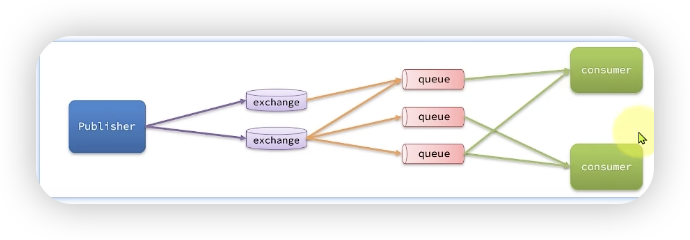

publisher(生产者) 向 exchange（交换机）发送信息，交换机经过内置的一系列规则，把信息传出到各个队列，队列出来传给服务消费者。

由于rabbitmq的性能强大，可以处理10w的并发，所以多个小项目可以用一个mq，这时候为了不会造成信息的错乱，会把每一个项目的交换机和队列放到一个virtual host空间（实现数据隔离）

下面的不重要

案例1:在rabbitmq的控制台上，新建并绑定2个队列给一个交换机，用这个交换机发消息

1.交换机只会传递信息，不会存储，容易造成信息丢失

2.交换机只有和队列绑定，才能发送消息

案例2.在控制台上创建用户，为用户创建Virtual host，查看用户权限。