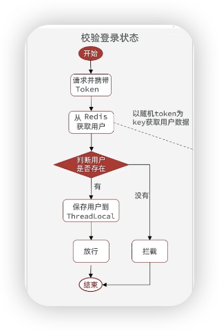

`HandlerInterceptor`

这个接口底下有3个方法

```java
public interface HandlerInterceptor {
    default boolean preHandle(HttpServletRequest request, HttpServletResponse response, Object handler) throws Exception {
        return true;
    }   //即在controller前执行拦截

    default void postHandle(HttpServletRequest request, HttpServletResponse response, Object handler, @Nullable ModelAndView modelAndView) throws Exception {
    }			 //在controller执行之后执行

    default void afterCompletion(HttpServletRequest request, HttpServletResponse response, Object handler, @Nullable Exception ex) throws Exception {
    }   //视图渲染后执行
}
```

- **`preHandle`**: 在控制器方法执行前执行，用于请求预处理，如权限验证。
- **`postHandle`**: 在控制器方法执行后、视图渲染前执行，用于修改视图和模型数据。
- **`afterCompletion`**: 在视图渲染后执行，通常用于清理资源。

---

#### **方法解读：**

上面最难理解的就是postHandle

例子：比如 UserController里面有一个 根据 id 回显user信息的方法，现在我们可以

```java
if (modelAndView != null && modelAndView.getModel() != null) {
            // 修改模型数据
            modelAndView.getModel().put("postHandleMessage", "数据已被拦截器修改");
```

然后在前端加一个标签，就可以修改视图了。      记忆方法：视图 -> view  ->VO 层的作用

```vue
 <p th:text="${postHandleMessage}"></p> <!-- 显示拦截器添加的消息 -->
```

**问题❓**

1.方法的参数：`HttpServletRequest，HttpServletRespnse`是浏览器发送的请求信息（请求头，请求参数）和响应信息，而 `hanlder`往往就是controller控制器的被请求的方法，`ModelAndView`是在controller执行后生成的模型数据，还没有被渲染成视图，可以背postHandler拦截修改，`Exception`是请求过程中发生的异常

2.为什么在preHandle也就是还没运行controller的时候就能获取到请求参数和响应信息（尤其是这个）

A：**响应信息** 在 `preHandle` 方法中主要用于对响应做一些预处理操作，但实际的响应内容直到控制器方法处理完毕并返回后才会生成。

3.为什么在after这个方法里面都已经渲染完了，为什么还需要请求信息和响应信息？

A：因为有的时候要输出错误的信息，就可以get到具体的信息比如

```java
 // 异常信息（如果有的话）
        if (ex != null) {
            System.out.println("请求处理过程中发生了异常: " + ex.getMessage());
        }

        // 记录请求和响应的信息
        System.out.println("请求 URL: " + requestURI);
        System.out.println("请求方法: " + method);
        System.out.println("请求来源 IP: " + remoteAddr);
        System.out.println("响应状态码: " + status);
```

---

添加拦截器

```java
@Configuration
public class MvcConfig implements WebMvcConfigurer{
 @Override
    public void addInterceptors(InterceptorRegistry registry) {   //注册器
    //添加自己创建的拦截器，在后面设置覆盖的范围
        registry.addInterceptor(new LoginInterceptor()).
        					addPathPattens("/admin/employee",    //添加覆盖的范围
        												"/shop");
      	registry.addInterceptor(new MyInterceptor()).
      						excludePathPattens("/login",
      												"/sendcode");				//除去不被覆盖的范围，比如一个登入校验拦截器，我们就要在登入前、发送验证码前别拦截
    }
}
```


---


#### 用户登入校验的例子

（这里用的是session，不好，因为不可以跨tomcat）

```java
public class LoginInterceptor implements HandlerInterceptor {

    @Override
    public boolean preHandle(HttpServletRequest request, HttpServletResponse response, Object handler) throws Exception {
        //从session里面拿到用户，判断用户是否存在，这里的存在不是说在不在数据库，
        //session里面存的user是注册或者直接登入放进去的
        HttpSession session = request.getSession();
        //这里用dto是为了隐藏敏感信息
        Object user = session.getAttribute("user");
        if (user == null) {
            response.setStatus(401);
            return false;
        }
        //用ThreadLocal保存数据传给controller
        UserHolder.saveUser((UserDTO) user);//保存在线程
        return true;
    }

    @Override
    public void afterCompletion(HttpServletRequest request, HttpServletResponse response, Object handler, Exception ex) throws Exception {
        //删除数据释放内存
        UserHolder.removeUser();
    }
}
```

因为顺着，顺便把ThreadLocal讲了。



ThreadLocal是用来把把前端拦截器之后的值传给controller的，他是一个泛型类，我们可以自己定义

`ThreadLocal<T>`下面有3个我们要用到的方法 get ，set ， remove

```java
public class UserHolder {
    private static final ThreadLocal<UserDTO> tl = new ThreadLocal<>();

    public static void saveUser(UserDTO user){
        tl.set(user);
    }

    public static UserDTO getUser(){
        return tl.get();
    }

    public static void removeUser(){
        tl.remove();
    }
}
```

这里写的dto是因为这个场景是返回数据，我们隐藏了密码等敏感信息

---

###### 改进

（不是上面这个session的版本，我们已经用redis替代了session）

我们会在拦截器的最后重新刷新token的有效期，但是比如购物网站的那些无需登入的查看商品等操作不会被拦截器所拦截，这时候就可能会莫名其妙地过期了，所以需要改进。

可以在拦截器前面再来一个拦截器（他拦截所有的路径），把之前的功能全部放到上面，第二个拦截器保留，只不过把if里面的判断条件变成了ThreadLocal是否存入数据。