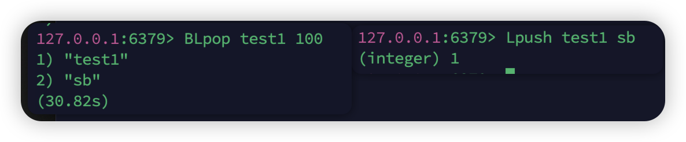

```
String   helloworld

Hash			{name:"jack",age:21}

List			[A->B->C->C]

Set				{A,B,C}

SortedSet		{A:1,B:2,C:3}

GEO 			{A:(120.3,30.5)}

BitMap		01010101010100111

HyperLog  01010101010100111
```

⚠️：命令不用全部记，在redis里面可以用 `help @genemic`查看通用命令.这里罗列的是常用的

`help 具体命令`可以查看具体的用法

### 通用命令

1.`KEYS patten` 查看  

和模糊查询有点相似，不过占位符是 `*和??` 

🌰： `keys *a*`

2.`DEL key [key...]`删除

🌰： `DEL name`

3.`exists key` 

4.`EXPIRE key seconds`给一个key设置存活时间  seconds为-1为永久有效 因为存在于内存

5.`TTL key` 查看剩余存活时间

### String

有String，int，float三种，后两种可以自增自减

字符串的大小不能超过512M

1.`set key value`

2.`get key`

3.`mset key value [key value...]`

4.`mget key key `

5.`incr key`自增  虽然有独立的自减但是一般用incr负数

6.`incrby key 步长`

7.`incrbyfloat key 步长`

8.`setnx key value`不存在时插入  nx = not exist

9.`setex key seconds value`

### Hash

无序字典，redis本来就是k-v数据库，这里就是kkv

1.`Hset` `HGet`

2.`Hmset` `Hmget`

3.`HgetAll key`获取全部

4.`Hkeys keyname`一个key中所有的field 

5.`Hvals keyname`所有的value

6.`Hincrby key field 步长`按步长自增

7.`hsetnx`

### List

约等于LinkedList双向链表

有序、元素可重复、查询慢、插入删除快

1.`Lpush key element`列表左侧插入

Lpush user 1 2 3 4 5  然后里面的数据是5 4 3 2 1

2.`Rpush key element`右侧

3.`Lpop`左侧删一个

4.`Rpop`右侧删一个

5.`Lrange key start end`返回两个角标的所有元素 0开始

6.`BLpop key timeout` 和上面的相同，不同的当没有元素时可以等待指定时间 b=block

阻塞队列



可以用来模拟栈和队列，无非是几个口

### Set

无序、不可重复、查找快、可以交并集

1.`Sadd`

 2.`Srem`

 3.`Scard` 返回元素个数 

4.`Sismember` 判断是否在set中

5.`Smembers`获取所有元素

6.`Sinter key1 key2 `  取交集

7.`Sdiff key1 key2`差集

8.`Sunion `并集

### SortedSet

功能上和treeset有点像

每一个元素有一个score属性，可以给予score属性对元素排序

1. `zadd key score member`
2. `zrem key member`
3. `zscore key member` 
4. `zrank key member`
5. `zcard key `
6. `zcount key min max `左右都是闭合
7. `zincrby key 步长 member`  区别于上面的就是步长放前面了，这里增加的是score的值
8. `zrangeBysort key min max`获取元素
9. `zrange  key  start end`获取该排序下的几位 0开头
10. 交并集差集(但是我使用的时候)(error ERR unknown command `ZINTER`)

默认是升序，在最后面加一个 rev