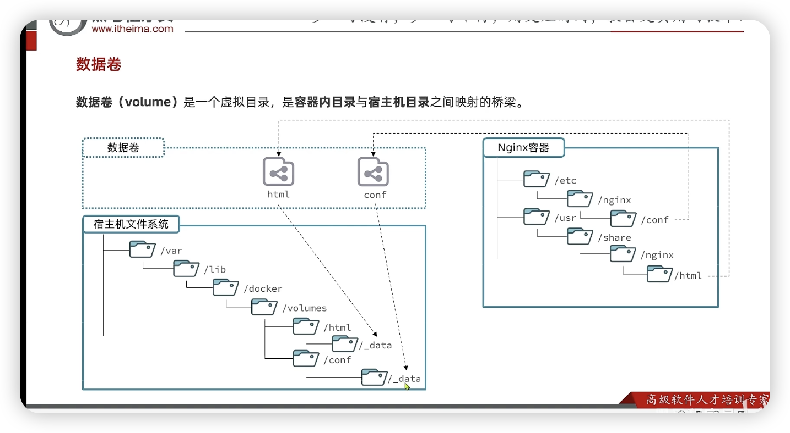

```
sudo mkdir -p /etc/docker
sudo tee /etc/docker/daemon.json <<-'EOF'
{
    "registry-mirrors": [
        "https://do.nark.eu.org",
        "https://dc.j8.work",
        "https://docker.m.daocloud.io",
        "https://dockerproxy.com",
        "https://docker.mirrors.ustc.edu.cn",
        "https://docker.nju.edu.cn"
    ]
}
EOF
sudo systemctl daemon-reload
sudo systemctl restart docker

```


##### 基本命令

`docker run`创建并运行一个容器

`-d`让容器在后台运行

`--name`给容器命名字  这里切记要名字，不然会创建一个没名字的容器，启动都无法启动

`-p 3306:3306`【 前主机，后容器内】 这里是宿主机（就是主机）对内部的容器内的【端口映射】：因为内部的容器，以mysql为例子，他的端口是3306，但是是对外隔离的，也就是说外部机器无法直接ping3306到mysql，就需要3306映射到主机的一个端口，比如开了多个mysql，主机可以3306，也可以3307

具体的镜像去文件里查找

最下面的mysql是镜像的名字 `mysql:8.3.1` 后面是你指定的版本


`docker push`把本地镜像上传到镜像仓库

`docker run` 【创建】并运行容器

`docker stop`停掉容器

`docker run`运行容器

`docker ps`查看容器运行情况

`docker ps -a`查看所有容器

`docker inspect`查看容器的信息，可以看到挂载情况，ip地址等详细信息

`docker rm` 删除容器

`docker rm -f` ??

`docker rmi` 删除镜像 得先停掉容器

`docker load -i ` 加载别人打包的

`docker save`保存镜像到tar或者tar.gz(压缩)

`docker images`查看本地仓库镜像

`docker exec -it 容器名字 bash` 进入该容器启动一个终端，相当于在一台可以操作该容器的电脑上操作.<u>是最小化的运行系统，所以可能没有vim等命令</u>

简化命令【即自定义命令】:`vim ~/.bashrc` 在 `alias`这里，例如`alias ll='ls -alF'`

 写一个命令后面不会写的时候 用`--help`  如`docker save --help`


##### 挂载数据卷

案例：想往容器里的nginx里面的文件夹里面修改conf文件和html目录下的东西，但是因为docker镜像创建的容器里面的终端只是有必须资源的最小系统，所以连vim这类基本的编辑器都没有，那么修改起来很麻烦，现在就可以用一个【虚拟】的数据卷来实现nginx容器内的文件夹和宿主机（虚拟机）里的文件夹的映射。然后再用ssh工具来使用本地主机上的软件来操作宿主机里的文件，会自动更新挂载的容器目标文件夹，十分方便。

对于容器要修改哪个文件夹，去镜像官网看文档

几个基本的命令

`docker volume`

```shell
Commands:
  create      Create a volume
  inspect     Display detailed information on one or more volumes
  ls          List volumes
  prune       Remove unused local volumes  删除和清除的区别还是蛮大的
  rm          Remove one or more volumes
```

```shell
docker volume cteate html:/abc/edf/html nginx    卷名:容器内要挂载的文件夹 容器名字
```

可以在创建容器时直接挂载

```
docker run -d --name mysql -p 3306:3306 -v myvolume:usr/mysql mysql 
```

查看创建的虚拟数据卷对应的宿主机目录路径

```
docker volume inspect html   这里是卷名
```

有的容器比如mysql，要存放大量数据，如果是存放在容器的文件夹里，那么随着使用的时间增加，容器的体量会变的很大，所以他默认保存在本地的数据卷里

但是本地数据卷的名字很长，打命令的时候不方便。实现挂载很不方便，所以我们可以在  `卷名:容器目标文件夹` 这里把卷名写成宿主机的目标文件夹，<u>**但是**</u>这里得写 ./mysql : usr/mysql   这里前面不加一个 `/`会被认为是一个卷名

