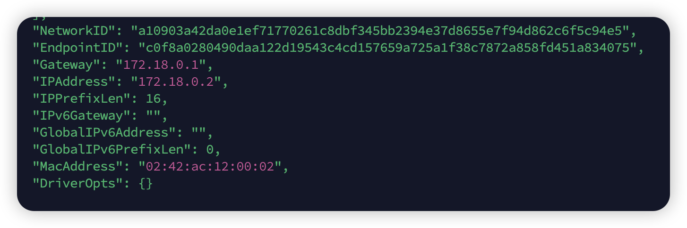
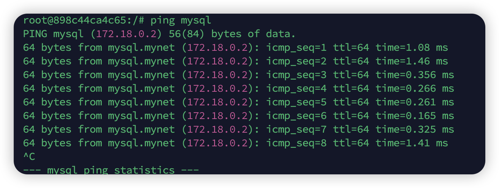

`docker network create`

`docker network connect 网关名字 容器名字` 连接容器到网关里

`docker network ls`

`docker network rm ` 删除网关

`dock network disconnect`断开链接

相同网关下的容器可以互相连接

网关: 172.18.0.0/16 16指的是前16位是固定的    计算机网络

只有在同一网关下的容器才能互相通信，下面是案例

案例：一个demo和mysql都在mynet网关下，但是nginx不在，现在在demo容器里面用ping命令分别pingmysql和nginx

