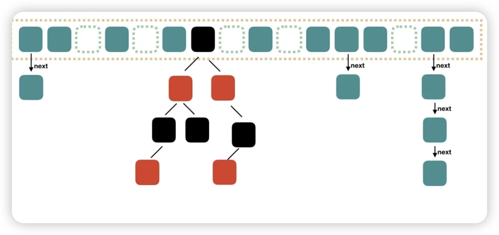
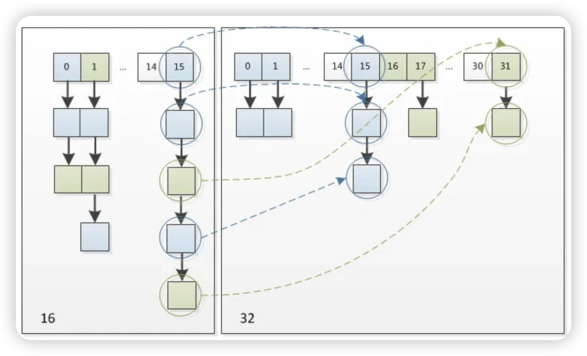

###### java中线程安全的集合

vector

hashtable

这两个里面都加了synchronized锁，增加了同步的开销，很少使用


###### ArrayList和LinkedList

关于插入和删除操作的效率：ArrayList通过索引可以快速定位O(1)，而LinkedList得遍历O(n),虽然ArrayList除了开头和结尾插入和删除是O(1)其他需要左移右移O(n),LinkedList的链表插入和删除的O(1)只是说在找到了位置进行操作的时候。所以LinkedList一般没人用

这两个线程都不安全


###### 怎么让ArrayList变成线程安全的,他自身哪里不安全

1.用Vector替代

2.用CopyOnWriterArrayList替代

3.`Collections.synchronizedList(ArrayList对象)`

不安全有3个点：

在高并发情况下

1.部分值为null：比如在两个线程，这里的例子是add时，如果size不够了会自动加一，两个线程都到了判断的地方，这时候轮到下标9，线程1和线程2都进来了，都size++了会导致下标10直接被跳过了为null

2.数组越界：和上面的例子一样，但是这时候是下标9，容量10，线程1看没有容量够，cpu切换成线程2也看容量够然后线程1添加了一个，变成了10，然后线程2继续添加，这时候就越界了

3.添加的数量和数组的size不符合：因为size++这个操作不是原子操作

###### ArrayList和Vector的扩容机制

前者1.5倍，后者2倍


###### CopyOnWriterArrayList线程安全的原理

底层还是用一个数组来存储数据，不过加了一个volatile修饰词，使得对数组的操作在其他的线程可以感知到。然后在add方法里面加了锁，通过copy一个新的容量加一的数组，然后在把add的值赋值到数组的末尾。读没加锁。


###### 1.8之后HashMap的实现原理

在1.8之前，是通过数组和链表来实现的，把每一个key映射到数组上的槽，叫桶数组然后映射到相同槽的就存储在一个链表里面。但是因为当映射到同一个槽的key太多了（也就是哈希冲突），会导致变成很长的链表，那么查询的效率就非常低了。

1.8之后，当一个链表的长度超过了8，自动从链表转换成红黑树，从O(n)变成了 O(logn)，而当小于6了，又会从红黑树变成链表结构。但是要数组的容量大于64才会变成红黑树，不然会先扩容数组。

为什么还说HashMap的时间复杂度是O(1)？ A：这是理想情况下，HashMap发生哈希冲突的概率很小



###### 哈希冲突的解决办法

1.连接法：是用链表或者其他数据结构来存储冲突的键值对（HashMap）

2.开放寻址法：在数据结构课上说的那个就是，通过一些函数计算到键的哈希值，直到找到一个空槽，那时候说的就是取模运算

3.再哈希法（双重哈希）：是开放寻址法的一种，不过他在计算index的时候，使用了两个哈希函数，如果发生冲突就启用第二个哈希函数

```
index = (hashCode1 + i * hashCode2) % array.length;
```

###### HashMap put的过程

1.根据键计算哈希码

2.检查该位置是否为空

3.如果发生哈希冲突，检查这个位置的第一个的键和添加的键是否相同，相同的话直接更改。如果不相同从链表遍历，找得到就更改，找不到就添加到链表的【头部】。

4.如果是红黑树的结构，那么会比较键的equals，若没有查到新节点会被插入到树的末端。

5.如果键值对的数量/数组长度 > 阈值(0.75一般是)  这个叫做负载因子。负载因子的作用是平衡存储效率和性能。 比如假如数组太少了，那么哈希冲突就会很多，影响效率。超过的话，数组会扩容到2倍。

###### HashMap get安全吗

不安全

1.若没初始化    xxxx 没初始化根本无法过编译

2.线程不安全：get和put的多线程没同步措施会导致读写异常，比如一个线程get读取的时候，另一个线程正在对这个key进行修改，就会造成读写异常

ps：hashMap的键可以是null，他内部的hash（）方法，默认把null的哈希值定为0


###### 为什么HashMap使用红黑树而不是平衡二叉树

知道大致的原理就行

平衡二叉树：为了避免树的高度增长过快，降低二叉排序树的性能，规定在插入和删除结点时，要保证**任意结点的左、右子树的高度差的绝对值不超过1**

红黑树：追求的是大致平衡，允许左右子树的高度差大于1，但要求从**根到叶子的最长路径不超过最短路径的两倍。**

由于AVL树非常严格的平衡性，插入和删除的操作后，有可能会非常频繁地调整全树整体拓扑结构，代价较大。
所以再AVL树地平衡标准上进一步放宽条件，就引入了红黑树。

两者在查找、插入和删除操作上的时间复杂度都是O(log n)，实际上红黑树效率更高

自平衡的方法：**变色、左旋和右旋**。


###### 重写HashMap的equlas方法不当会发生什么问题

因为先是hashcode拿到哈希值定位到数组的位置，然后用键的equals来匹配，所以equals为true的话，hashcode必定为true，但是反之不然。如果方法重写不当会导致equals为false导致写入重复的key。


###### 多线程HashMap 可能发生的问题

同时执行同一个key的put的时候，会进行覆盖，导致数据丢失


###### HashMap的扩容机制

比如size 16变成了32

16 二进制10000

32 二进制 100000

这里看的是老的位数，比如这里就是 10000 也就是5，因为哈希值是一个整数，转为二进制，然后就查看他的第5位是0还是1，如果是0，则索引值不变，如果是1，则索引值为老的索引值加老的size。这样一来就不需要再次计算hash了，而且因为哈希值本来就是随机的，那么那个位上的0和1也是随机的。



在面试题里面问扩容几次，是按照负载因子来的。初始的容量是16


###### ConcurrentHashMap的实现

HashTable基本被淘汰了，所以线程安全用ConcurrentHashMap来替代。

在java7的时候，使用的是分段锁，把一个hashmap分成多个Segment，每一个Segment可以看成是一个小hashMap，在进行操作的时候，定位到segment来进行上锁，然后每一个segment再分成数组，其他和hashmap一样，但是由于数据一多效率低就淘汰了。


**CAS 操作**、**节点级别的锁**、**无锁读取** 和 **并发扩容**

1.CAS即compare and swap 用它来实现【无锁的并发控制】，说白了就是乐观锁，比较内存中的值和预期值（先存入的那个）来决定是否更新。但是和普通的乐观锁不同，**他是硬件级别的原子性操作**，所以不必担心混乱，即使cas操作失败，他会自动自旋重试直到成功

2.synchronized on Node ：在链表和红黑树这种的发生哈希冲突的地方，在他们的头节点加锁

3.直接读取，使得读取的时候无序获取或者释放锁，保证了高并发下的读取性能

4.原本的hashMap扩容是一次性锁定整个哈希表进行扩容，这个让每个进程来负责将分配到的数据迁移到新数组，然后有一个迁移状态，迁移过去之后会标志，以防其他线程重复迁移。


###### 为什么用了CAS还要synchronized

在bucket地方没有值的时候才会使用cas，因为本来哈希冲突就是几率极小的情况，发生这种情况的时候是很多的并发，这时候cas频繁失败导致大量的自旋重试，会导致效率下降，所以使用synchronized


###### ReentrantLock可重入锁

比如在redis秒杀里面在获取到锁的时候，再次获取锁会让计数器加一，而释放锁会让计数器减一，当计数器为0的时候才能真正释放锁


###### Set不重复元素的原理

set实现原理：Set集合通过内部的数据结构（如哈希表、红黑树等）来实现key的无重复。当向Set集
合中插入元素时，会先根据元素的hashCode值来确定元素的存储位置，然后再通过equals方法来判
断是否已经存在相同的元素，如果存在则不会再次插入，保证了元素的唯一性。


###### 有序的set

LinkedHashSet和TreeSet

TreeSet：是基于红黑树实现，保证元素的自然顺序。这里的自然顺序指的是经过比较器之后的排序

LinkedHashSet：是基于双重链表和哈希表的结合来实现元素的有序存储，保证元素添加的自然顺序。**双向链表**：`LinkedHashSet` 内部维护了一个双向链表，用来记录元素的插入顺序。每个元素除了存储在哈希表中外，还会在双向链表中占据一个节点，这个节点包含指向前一个元素和后一个元素的指针。


###### 双向链表和单向的区别

双向链表有pre和next，可以双向遍历，在比如浏览器的前进后退可以使用。


