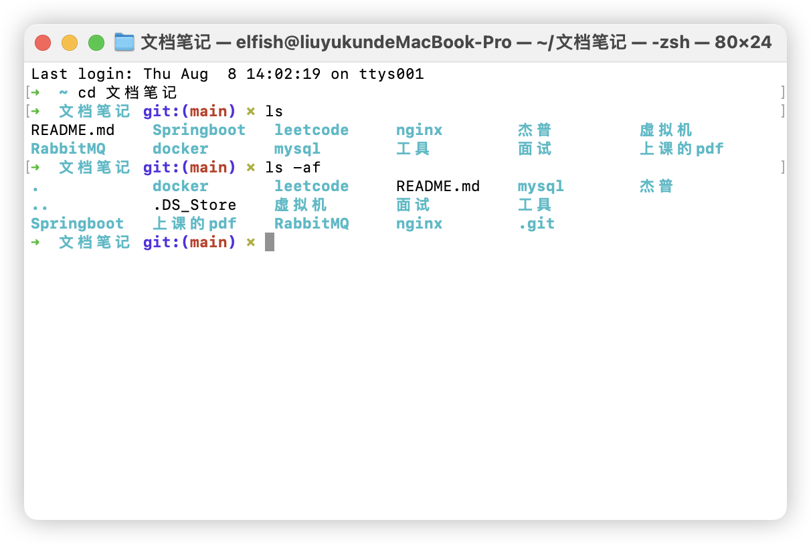
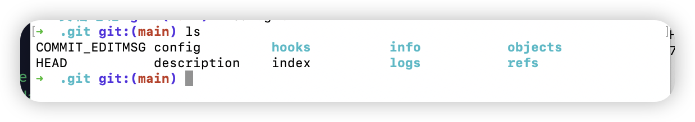
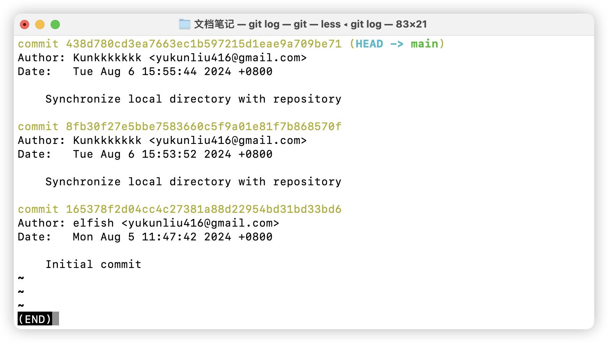
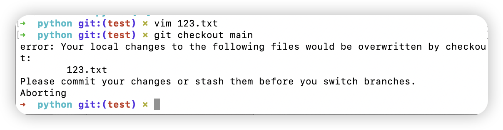
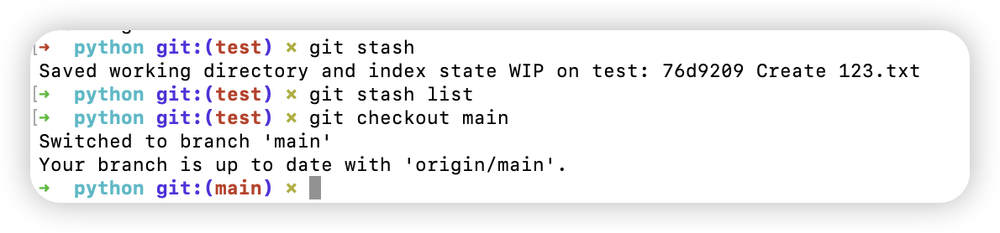
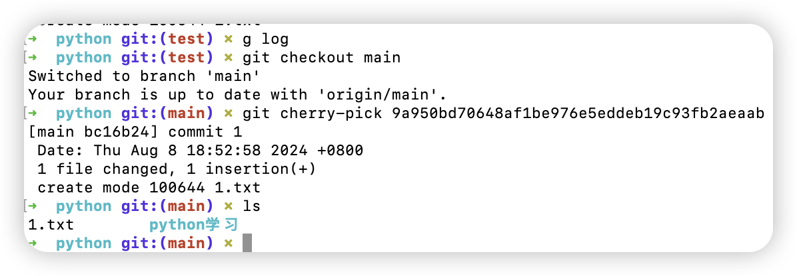
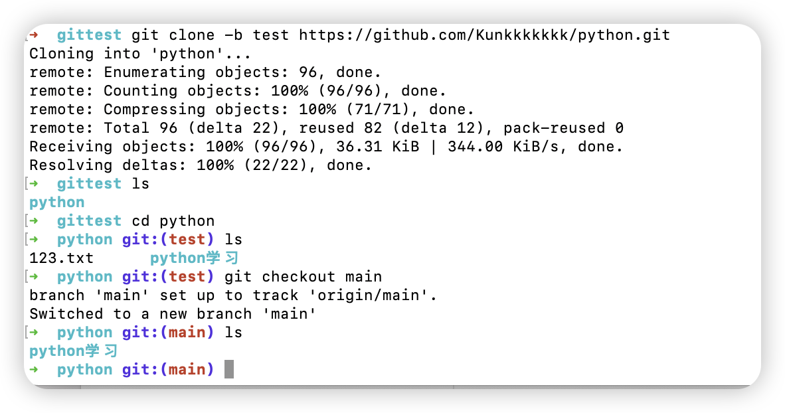

#### 分布式版本控制系统和集中式

##### 集中式：

即<u>本地客户端只保存当前的版本信息</u>，而所有东西都保存在一个中央服务器上。如果这个服务器一天崩溃了，那么所有的东西就丢失了。当你想进行回滚操作是时都得向服务器发出请求。

因为全在中央服务器上，所以会有一个版本号，每一次的版本迭代都会更新这个版本号。

##### 分布式：

即从主仓库里拉取一份代码到本地之后，个人的电脑就变成了一个“服务器”，每个人的电脑都是一个服务器，那么就没有固定统一的版本号。有一个master仓库，我们可以把本地的东西上传到（commit）本地仓库然后通过合并或者push到主仓库上。同样我们可以把个人的仓库分享给别人。

分布式（这里主要说的是git）有一个缓存区的概念

#### 安装git

mac

```shell
brew install git
```

linux/debian(ubuntu)

```shell
sudo apt install git
```


#### 关于配置

`git config --global`全局配置

设置邮箱和用户名，在遇到需要远程登入的仓库比如github时就会自动帮你填好，只需要输入密码

`git config --global user.name "Kunkkkkkkk"`

`git confif --global user.email "12321312@gmail.com"`

#### 本地仓库的操作

##### 1.创建

```shell
$cd /xx/xx/xx   #进入目标目录下
$git init    #会自动将当前仓库设置成master
```

在这个目录下会有一个隐藏文件夹 `.git`用普通的ls看不到，得 `ls -ah`



在这个文件夹下面就是git仓库的支架


删除仓库：把该文件夹下的 .git文件夹删了就行

##### 2.提交到本地仓库

我们可以把文件放进去然后通过 `git add abc.md`即可以把abc.md提交到仓库的提交缓存里面，但是这时候不算提交成功，还需要添加修改的描述信息

`git commit -m "add abc.md "` 这里如果不用 -m会自动启动一个vim编辑器要你在里面写，都是一样的。

像删除操作，也只是放到暂存区

每一次提交会生成一个hashcode

然后提交了之后感觉这个message想改，可以 `git commit --amend`就能进入vim编辑器来更改上一次提交的.

`git log`可以查看提交记录，<u>前提是要进入你初始化本地仓库的文件夹里</u>

`git log --oneline `简易显示

`git ls-files`可以查看该仓库里的所有文件

`git status`可以查看状态，其中几个

1.Changes not staged for commit:即仓库里的文件更改了但是还没commit 

2.Untracked files:即放了一个新的文件在仓库文件夹里面


##### 3.回滚

###### 1.回滚整个提交

每一次commit会生成一个40位的hashcode，我们这里为了记忆只学【硬回滚】

硬回滚就是完全回滚到上一个提交，包括工作目录和暂存区的状态：

- **提交历史**：最新的提交会被撤销，HEAD指向上一个提交。
- **暂存区**：恢复到上一个提交的状态。
- **工作目录**：恢复到上一个提交的状态。

NoNoNo千万别用这个b硬回滚，导致我写这个文档的时候丢失了好多数据还好找回来了md

用默认的混合模式

- **提交历史**：最新的提交会被撤销，HEAD指向上一个提交。
- **暂存区**：恢复到上一个提交的状态。
- **工作目录**：不变

默认就是混合模式 `--mix`



如上，本来有10多条，往很前的一个版本回滚了，只剩几条历史记录了

方式1:`git reset  要回滚的 id`

方式2: `git reset  HEAD ^`这个 `^`就是向上，即往前一个版本回滚

`git reset  HEAD 数字` 就是向前回滚几个版本

###### 2.回滚指定文件

2种指令，一个checkout一个restore（更推荐）

`git checkout -- filename`回滚到你最后一次提交时文件的状态

`git checkout <id> -- filename`回到指定的版本

---

`git restore --source=<id> filename`

`git restore filename` `回滚到你最后一次提交时文件的状态

#### 工作区缓存区

工作区就是你的本地文件夹，缓存区是上面展示的 `.git`隐藏文件夹底下的一个叫

`/index`的文件夹

`git add`把改动的文件添加到缓存区

`git add .`和--all是一样的,但是不会记录删除操作

`git log filename`查看具体某个文件可以回滚的版本

`git reflog`会记录分支的引用（ref）移动情况，回滚也会，但是这里对单个文件的回滚不会记录进去，因为对单个文件的回滚只时对文件的内容进行修改，没有改变任何分支的引用。

`git rm`这里的删除只是从缓存区里面删除，还可以add回来

`git reset` 我们add错了东西，用这个清空缓存区

#### 分支

`git branch 分支名字` 创建分支

`git checkout 分支名字 `切换进该分支

`git branch -D 分支名字` 删除本地分支

`git push origin --delete 分支名字` 删除远程分支

`git branch -m 分支名 新的分支名` 

`git branch -a` 查看所有分支

`git branch` 查看当前所在分支

`git branch -r` **显示所有远程追踪的分支**，即就算直接clone下来只有main分支，但是可以用这个可以查到所有分支然后手动检出（checkout，md我还以为是什么呢）

切换进入分支之后 使用 `git merge 分支名字` 可以将目标分支和所在分支合并

**合并不代表一直合并：只是合并了历史**

不同分支未提交的文件在每一个分支里都能看到，提交了之后就看不到了。

现实里的分支使用：在团队开发中，master只有一个，合作开发里任何人都可以从master里拉取代码，拉取时master后创建分支，分支名改为你要做的操作，比如修改某某文件，修改什么什么bug，单词以下划线做分割，然后在提交一个版本

---

保存工作状态 `git stash `： 在当前分支下修改了文件，再切换分支会报错（如下图）：为了避免刚修改的东西被丢失，因为假如是目标分支和当前分支下有两个相同名字的文件，就会产生冲突。

可以通过  `git stash list`





你对修改的东西进行add，commit操作之后，他还是会保存在list里面，这时候可以用 `git stash drop`删除最近的stash或者 `git stash drop stasg@{n}`删除指定的

清除所有stash `git stash clear`

一般情况下，我们在修改代码时，突然来了一个新的需求，让我们先去做这个需求，但是此时我们正在写的代码还没有完成，是不可以提交的，所以我们先使用git stash保存当前工作状态，在拉取一个分支去这个分支里面干活，干完活之后回到之前的分支，在将工作内容恢复出来继续干活

我们可以使用 `git stash show`来对比现在的文件和保存时的差异

---

把某个提交（不同的分支）转移到目标分支

`git cherry-pick <hashCode>`得先进入目标分支



csdn他那个说的是直接后面跟一个分支，纯纯sb，那不就跟merge一样了吗

#### github

ssh那些忘了，要弄上网查

由于 GitHub 已经弃用了密码认证，你需要使用个人访问令牌（Personal Access Token）而不是密码。将 `<personal_access_token>` 替换为你的个人访问令牌。

---

私人仓库改成public在设置里拉到最下面的danger zone

❓为什么我是仓库的主人但是无法clone下来这个private仓库

---

本地仓库关联 `git remote add origin github上的ssh连接 `

本地仓库推送到远程仓库 `git push -u origin main/master看你的分支是什么`

-u 指的是除了main分支，其他分支也提交上去，远程仓库上就能看到本地仓库创建了多少分支

origin 表示远程仓库，要远程必须要这个

---

直接把远程仓库关联到本地文件夹

进入目标文件夹里面，不要init初始化仓库，直接`git clone url`。不仅会把远程仓库的所有文件，还会让你的这个文件夹成为一个仓库。

想直接clone下来然后切换到指定分支可以直接 `git clone -b 分支名字`



从上面可以看到，其实我是把所有的文件克隆到本地仓库了，同时也保留了分支，依旧是进入哪个分支显示哪个分支的东西。

查看远程仓库分支 `git remote show origin`


---


