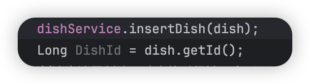

```xml
<mapper namespace="com.sky.mapper.DishMapper">
<!--打开可以使用生成的id，后面是返回的名字-->
    <insert id="insertDish" useGeneratedKeys="true" keyProperty="id">
        insert into dish(name,category_id,price,image,description,status)
        values (#{name},#{categoryId},#{price},#{image},#{description},#{status})

    </insert>
</mapper>
```



dish本来没有id，但是使用它插入之后他就生成了并赋值给了id

