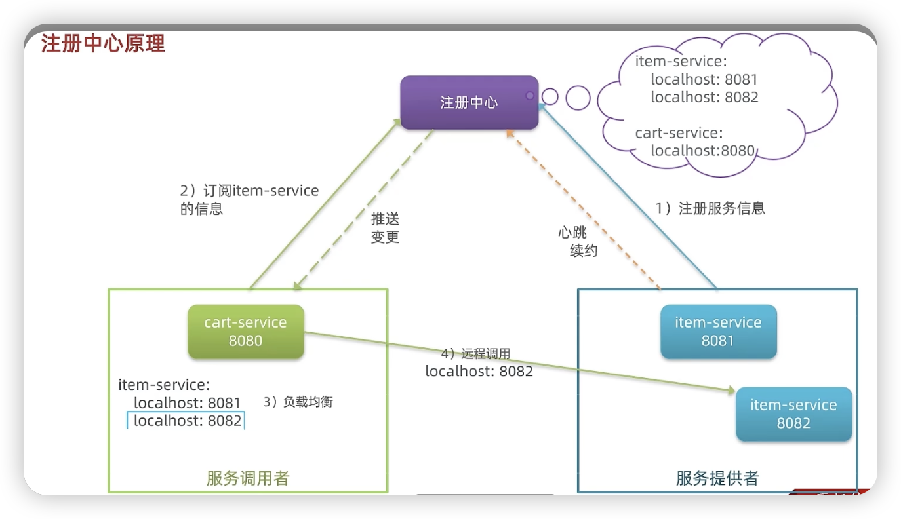
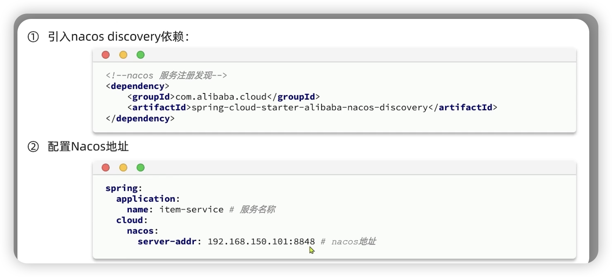
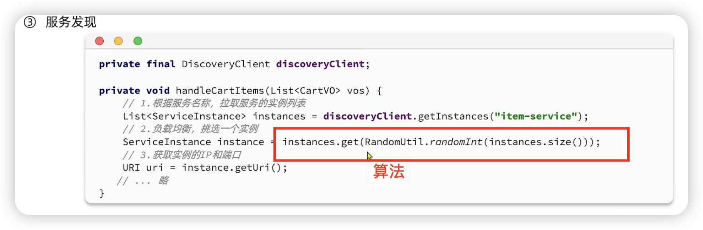
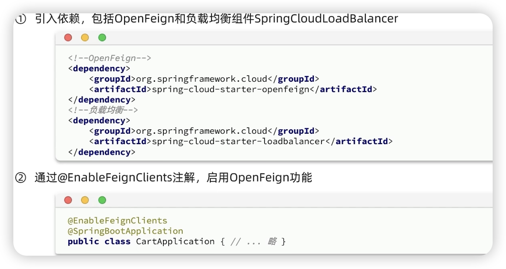
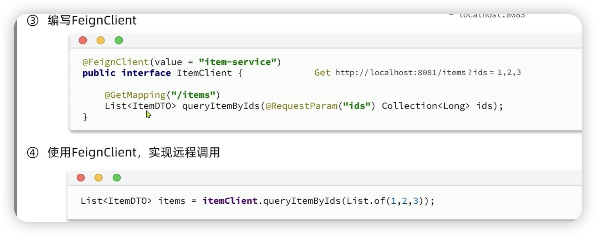

##### 跨请求（一个单体项目）：

1.session。在要用到跨请求的地方（指定的controller方法里） 用再传一个Httpsession对象，直接在里面使用session存取数据实现跨请求（因为session在同一个服务里是共享的）

2.ThreadLocal，是一个泛型类，我们自定义返回的类型，使用它的静态方法有三个方法

get ，set ， remove

```java

public class UserHolder {
    private static final ThreadLocal<UserDTO> tl = new ThreadLocal<>();

    public static void saveUser(UserDTO user){
        tl.set(user);
    }

    public static UserDTO getUser(){
        return tl.get();
    }

    public static void removeUser(){
        tl.remove();
    }
}
```

这样理很乱，配合例子来说，就说发验证码登入

1.发验证码：把随机的字符串存储在redis里面，k是手机号

2.登入：通过手机号从redis里面取出来，验证操作，成功登入，这时候我们生成一个随机token作为k把用户存入redis，再返回一个token，在前端文件里面修改，session storage里面拿到一个data，然后修改请求头，把这个data放入请求头，并设置一个名字。

3.登入校验：在拦截器里用Httprequest.get(指定字段)拿到token，再用token从redis里面拿到对象【这里注意，假如是Hash结构的用entries方法拿数据】，


3.1token的刷新拦截器：因为假如一致访问的都是不需要登入校验的地方，那么token就会过期，就得再登入了，这时候我们可以在登入校验这个拦截器前再弄一个拦截器，在这个拦截器里面全部都放行，不过会用ThreadLocal存入redis里的东西，然后在进入登入校验的拦截器，通过判断threadLocal是否为空来决定放行与否。

---


##### 跨服务

因为是不同的端口了都甚至不同的ip地址，而http session只在相同的tomcat上可以公开访问，所以我们要用到**远程调用**。

1.首先我们先使用restTemplate


```java
 ResponseEntity<List<ItemDTO>> exchange = restTemplate.exchange(uri.toString()+"/items?ids={ids}",
                HttpMethod.GET,
                null,
                new ParameterizedTypeReference<List<ItemDTO>>() {
                },
                map
        );// 这是上面那个图里的，因为第四个参数按下面那张图得类类型字节码，但是泛型不在字节码的范畴里面，所以用上面的参数种类引用，这里是一个反射。
```


在处理带有泛型的类型时，Java 的类型擦除机制会丢失具体的泛型类型信息，因此需要借助反射机制来传递这些信息。


然后用exchange.getBody()就能得到返回值

2.因为一个服务可能开很多台服务器，而且我们不能把url写死，这时候就要一个注册中心，我们用的是nacos





我们的nacos是运行在docker里。

消费者也要配置好nacos，然后就可以发现服务，直接拿到他的uri 【uri不是urL，在我的文档里有写】


然后就可以不用手写url了。

但是现在有2个问题

1.这个exchange是不是感觉还是一大串呢

2.负载均衡算法很复杂的，我们这样写的在后期无法满足性能需求

所以我们可以用Openfeign来发送http请求





---


##### 自动装配其实就是自动注入

@Resource也行

叫法不一样，一个是从我们视角，一个是从spring容器的视角

属性注入

```java
public class MyService {
    @Autowired
    private MyRepository myRepository;
}
```

构造方法注入

```java
@Service
public class MyService {
    private final MyRepository myRepository;

    @Autowired
    public MyService(MyRepository myRepository) {
        this.myRepository = myRepository;
    }   //但是我们可以用lombok的@RequiredArgsConstructor来实现常量的构造方法

    // 其他代码
}
```

首选构造函数注入：构造函数注入被认为是更好的实践，因为它能够确保依赖关系在对象创建时即被完全初始化，并且有助于保持对象的不可变性。

属性注入：可以用于简单的、无状态的类，但不推荐用于复杂的类或需要维护较长生命周期的类。

总结

属性注入：适合简单场景和开发方便，但有隐藏依赖关系和较差的测试性问题。

构造函数注入：更明确依赖关系、支持不可变性、更易于测试，通常是更好的选择。

---

##### 微服务和分布式的区别

微服务强调的是业务逻辑的拆分和模块化，而分布式系统强调的是资源、任务的分配和协调

---

##### 反射机制
