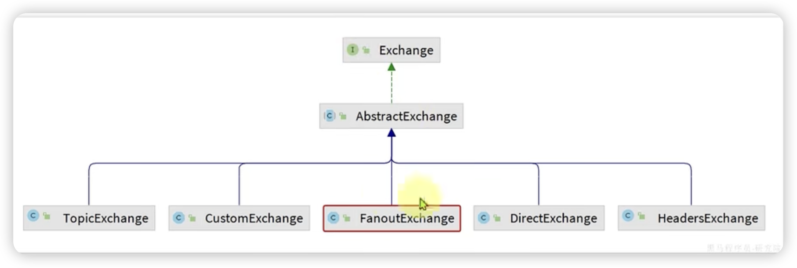
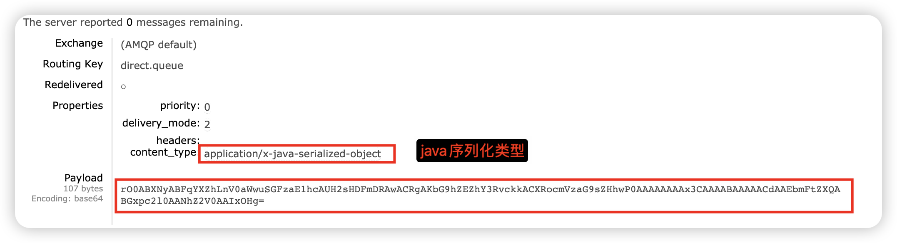
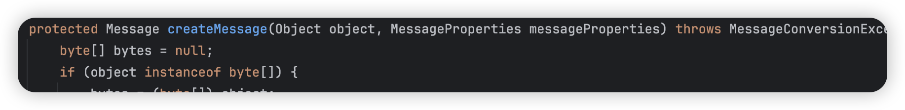

##### 依赖

```xml
<dependency>
            <groupId>org.springframework.boot</groupId>
            <artifactId>spring-boot-starter-amqp</artifactId>
        </dependency>
```

##### 配置文件

```yaml
spring:
	rabbitmq:
		host: 192.168.150.101
		port: 5672
		virtual-host: /hmall
		username: hmall
		password: 123321
```

##### 往队列里发消息

```java
@Autowired
private RabbitTemplate rabbitTemplate;
public void sent(){
String msg = "hello,world";
String queueName = "springamqp.test";
rabbitTemplate.convertAndSend(queueName,msg)
}
```

##### 往交换机里发消息  

**routingkey**就是一个路由key，在交换机和队列绑定的时候会有一个bindingkey，在这里他的作用是根据一定的规则，交换机根据这个routingkey=bindingkey把消息传到对应的队列。

```
和上面一样，不过要三个参数rabbitTemplate.convertAndSend(exchangeName,rountingkey,msg)
```

##### 监听信息

```java
@Component
@Slf4j
public class listener{
@RabbitListener(queue="springamqp.test") //这里写要监听的队列
public void listen(String msg) throws InterruptedException{
		//这里的参数看你要监听的东西都类型
		//现在已经拿到了这个msg，输出或者别的操作
		log.info(msg);
}
}
```

---

##### 基于代码带创建和声明队列和交换机

在开发环境中不可能在控制台手动创建交换机和队列，第一人为容易出错，第二很麻烦。springamqp给了几个类来生命队列、交换机、绑定关系

3个类 Exchange Queue Binding 



因为消费者更加关心收到消息，所以我们一般在消费者这边声明交换机队列等

###### 1.就是下面⚠️2那里写的代码，手动创建bean

缺点是：代码冗余

###### 2.使用SpringAmqp的注解@RabbitListener

```java
@RabbitListener(bindings = @QueueBinding(
            value = @Queue(name = "direct.queue"),
            exchange = @Exchange(name = "hmall.direct",type = ExchangeTypes.DIRECT),
            key = "mykey"
```

【这里的key不仅可以string，也可以数组】如 

```java
key = {"my","key"};
```

##### 数据转换器convert

###### 1.JDK自带的

比如我们直接向队列发送一个Map类型的消息，然后我们去控制台上，发现是一大行序列串

```java
    @Test
    public void sent(){
        Map<String,String> map = new HashMap<>();
        map.put("name","lisi");
        map.put("age","18");
        String exchange = "direct.queue";

        rabbitTemplate.convertAndSend(exchange, map);
```




我们从convertAndSend方法里面一直刨，可以在 `SimpleMessageConvert`里面找到一个方法，就是把java的一些类型序列化，用的是【ObjectOutputStream】



```java
else if (object instanceof Serializable) { //可序列化类型
            try {
                bytes = SerializationUtils.serialize(object);
            } catch (IllegalArgumentException var5) {
                IllegalArgumentException e = var5;
                throw new MessageConversionException("failed to convert to serialized Message content", e);
            }

            messageProperties.setContentType("application/x-java-serialized-object");
        }
```

```java
  public static byte[] serialize(Object object) {
        if (object == null) {
            return null;
        } else {
            ByteArrayOutputStream stream = new ByteArrayOutputStream();

            try {
              
              
                (new ObjectOutputStream(stream)).writeObject(object);
              //是通过这个字节流写入来序列化的
              
              
            } catch (IOException var3) {
                IOException e = var3;
                throw new IllegalArgumentException("Could not serialize object of type: " + object.getClass(), e);
            }

            return stream.toByteArray();
        }
    }
```

但是JDK自带的这个序列化有3个问题

1.安全风险，容易被注入（这个我不懂）

2.序列化后的消息体积太大

3.可读性差

所以我们使用Json转换器

---

###### 2.JSON转换器

以jackson依赖为例子

```xml
<groupId>com.fasterxml.jackson.core </groupId>
            <artifactId>jackson-databind</artifactId>
```

由于spring的自动注入，我们只需要在config或者其他任何地方创建一个@bean即可，他会【自动把这个消息转换器注入到Rabbitmq里面】

```java
@Bean
    public Jackson2JsonMessageConverter messageConverter() {
        return new Jackson2JsonMessageConverter();
    }
这里也可以直接用接口类型为返回的类型，spirng会自动装配
  @Bean
    public MessageConverter messageConverter() {
        return new Jackson2JsonMessageConverter();
    }
```

然后我们发送之后在控制器上看到的就是json类型，如果我们要在自己的消费者监听到json类型，那么也需要弄一个相同的消息转换器。


---

⚠️1.关于同类型不同bean名称是否会出现歧义错误

⚠️2.为什么下面这些，我把我的监听器关掉了他就不会运行

```java

@Configuration
public class EQconfig {
    //fanout交换机
    @Bean
    public FanoutExchange fanoutExchange() {
        return new FanoutExchange("hmall.fanout");
    }
    //fanout队列
    @Bean
    public Queue fanqueue() {
        return new Queue("fanout.queue");
    }
    @Bean
    public Binding binding1(Queue fanqueue, FanoutExchange fanoutExchange) {
        return BindingBuilder.bind(fanqueue).to(fanoutExchange);
    }


}
```

⚠️3:bean名称和bean里的 <u>传的参数是bean的名字，</u>为什么？

⚠️4:@SpringbootConfiguration和@Configuration的区别

---

A1:不会，只要确保参数命名唯一就行

---

A2:因为springamqp里面默认如果没有消费者，则不会去创建交换机和队列。

别的解决办法：加一个AmapAdmin.

```java
 @Bean
    public AmqpAdmin amqpAdmin(ConnectionFactory connectionFactory) {
        return new RabbitAdmin(connectionFactory);
    }
```

---

A3:spring框架的依赖注入机制，具体看spring文件夹里的笔记

A4:*@Configuration* vs *@SpringBootConfiguration*:

As per the Spring documentation, *@SpringBootConfiguration* is just an alternative to the Spring standard *@Configuration* annotation. The only **difference between the two is that the \*@SpringBootConfiguration\*allows the configuration to be found automatically.**

可以理解成没区别，只是标识成是springboot项目。但是官方文档说的可以被自动找到。