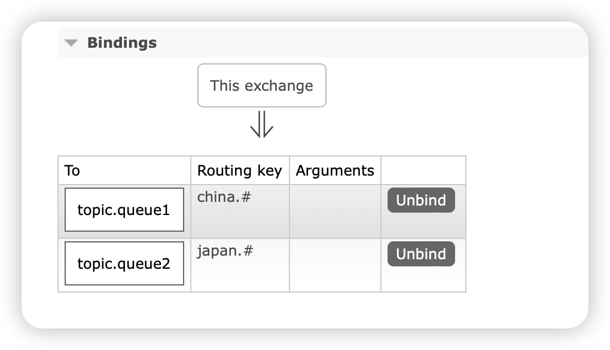

交换机：把消息路由到队列

有3种

Fanout 广播

Direct 定向

Topic 话题

#### Fanout交换机

收到生产者的消息，会把消息复制路由到每一台交换机上

#### Direct交换机

在绑定交换机和队列的时候加上一个bindingkey，然后往交换机使用 `rabbitmTemplate.convertAndSend(exchangeName,routingKey,msg)`

只有bindingkey和routingkey相同的队列才能被路由消息

#### Topic交换机

有点像mysql里的like，不过这里用`*`代替了`_` ,用 `#`代替了 `%`，bindingkey里面可以用这些通配符来写，发送的routinglkey里面可以有 `.`类似于china.weather.对key的绑定更方便了

