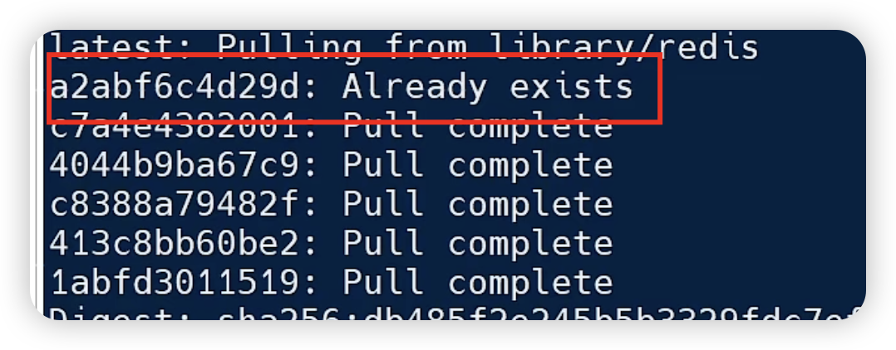

镜像是分层的



镜像的结构


每次操作产生的文件压缩了就是每一层


构建一个Dockerfile文件，然后用 `docker build -t 镜像名 dockerfile所在目录`

如果就在dockerfile所在目录时,  `docker build -t 镜像名 .`


```
# 基础镜像
FROM openjdk:11.0-jre-buster
# 设定时区
ENV TZ=Asia/Shanghai
RUN ln -snf /usr/share/zoneinfo/$TZ /etc/localtime && echo $TZ > /etc/timezone
# 拷贝jar包
COPY docker-demo.jar /app.jar
# 入口
ENTRYPOINT ["java", "-jar", "/app.jar"]
```

