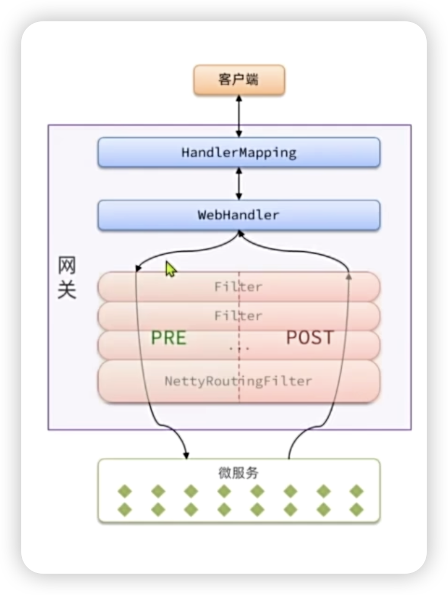
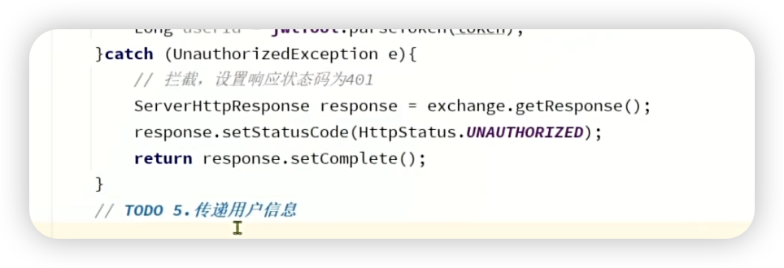
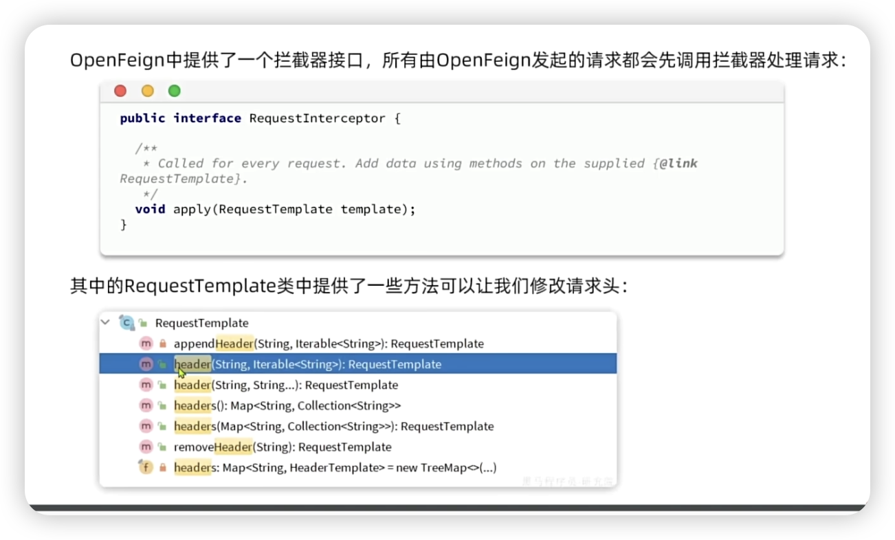
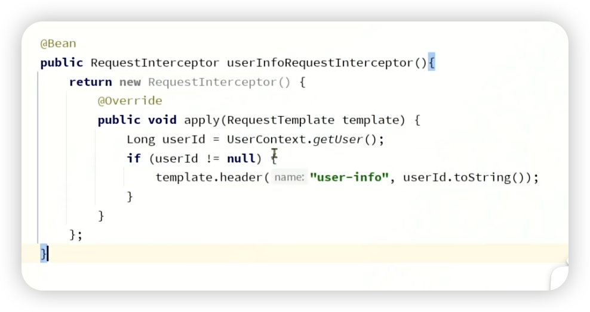

```yaml
spring:
  application:
    name: gateway
  cloud:
    nacos:
      server-addr: 172.16.98.128:8848
    gateway:
      routes:
        - id: item # 路由规则id，自定义，唯一
          uri: lb://item-service # 路由的目标服务，lb代表负载均衡，会从注册中心拉取服务列表
          predicates: # 路由断言，判断当前请求是否符合当前规则，符合则路由到目标服务
            - Path=/items/**,/search/** # 这里是以请求路径作为判断规则
        - id: cart
          uri: lb://cart-service
          predicates:
            - Path=/carts/**
        - id: user
          uri: lb://user-service
          predicates:
            - Path=/users/**,/addresses/**
        - id: trade
          uri: lb://trade-service
          predicates:
            - Path=/orders/**
        - id: pay
          uri: lb://pay-service
          predicates:
            - Path=/pay-orders/**
```

springcloud官网有文档说明了其他的配置，比如fliter


我们为了提高比如登入校验这种代码写的次数，会在网关里面放过滤器。



我们要把我们的过滤器放在pre阶段和netty路由过滤器之前，这个netty是用来转发请求到微服务的。

分两种，一种是全局过滤器GlobalFilter：所有的路由，声明之后自动生效

一种是路由过滤器GatewayFilter：指定路由，默认不生效





item/** 和item/search这种类型的比较


问题：网关在放行前把数据传给微服务是怎么实现的

保存到请求头，然后通过openfeign传给微服务，像一个微服务中比如cart里面基本每一个业务都需要登入校验，那么就得写很多次，这时候可以通过拦截器，把过滤器传过来的请求头放到ThreadLocal里面使用

存到请求头里可以使用 `exchange.mutate().request(build->build.方法)`


然后在微服务之间传递用户信息的时候，因为上面在网关设置的携带请求头，但是微服务之间直接是openfeign，这时候不会携带请求头就会导致获取到null，所以我们发openfeign的时候





要放到feign的启动类里面