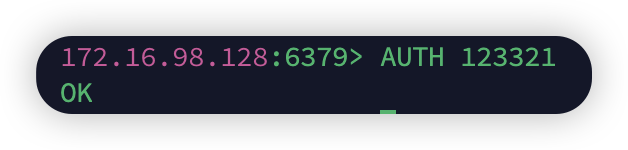

#### 启动和相关配置

`redis-server redis.conf` 启动 这里是在config文件里面设置了后台运行，就不用重新打开一个终端了

`redis-cli -a 密码 shutdown`可以关闭，前提是在conf文件里面protected-mode字段为no


一般可以用 `kill -9 PID `来关掉

查看PID  `ps -ef | grep redis`


我们可以配置一下，然后用systemctl来操作redis 和设置开机自启

tmd烦死了我的失效了，一直说

```
redis.service: Service has no ExecStart=, ExecStop=, or SuccessAction=. Refusing.
```

sb

1.在`/etc/systemd/system`下面修改 `redis.service`，没有就自己创建一


创建了之后要重新加载system文件 `sudo systemctl daemon-reload`

```.service
[Unit]
Description=Redis Server
After=network.target
 
[Service]
User=redis
Group=redis
ExecStart=/usr/bin/redis-server /etc/redis.conf
ExecStop=/usr/bin/redis-cli shutdown
Restart=always
 
[Install]
WantedBy=multi-user.target

```

### 关键配置解释

- **`User=redis` 和 `Group=redis`**: 这是运行 Redis 服务的用户和用户组，通常设置为 `redis`。

- **`ExecStart`**: 这个指令指定了启动 Redis 服务的命令，通常指向 `redis-server`，并指定 Redis 配置文件的位置（如 `/etc/redis/redis.conf`）。

- **`ExecStop`**: 这个指令指定了停止 Redis 服务的命令，通常使用 `redis-cli shutdown` 来安全地停止 Redis。

- **`Restart=always`**: 这个选项确保 Redis 服务在意外崩溃时会自动重启。

- `WantedBy=multi-user.target` 是 `systemd` 单元文件中 `Install` 部分的一个选项，用来指定在系统启动时，该服务应在哪个目标（target）下启动。

  ---

  

2. `systemctl start redis`启动

 		`systemctl stop redis`停止

​		`systemctl restart redis`重新启动

​		`systemctl status redis`查看状态

​		`systemctl enable redis-server`开机自启 这里网课视频上是直接redis，没有用，因为这里需要具体的服务名称，可以使用 `systemctl list-unit-files | grep redis` 来查看所有的具体服务， 不过关闭开机自启时可以systemctl disable redis关闭


`grep`是linux的命令，全称 Globally search a Regular Expression and Print全局搜索并打印。

​       

### 客户端

#### 1.命令行

`redis-cli`

`-h 172.16.98.128` 指定链接的redis节点的ip地址

`-p 6379` 指定要链接节点的端口

`-a 123321` 密码

如果什么都不指定，则会进入默认的127.0.0.1


会发现有警告，我们可以先不输入密码，进去了之后使用 `AUTH [username] password` 没有username就只需要输入密码就行 

`ping`和服务器打招呼，相当于ping网络


#### 2.adm 或者其他图形化工具

#### 3.Java客户端

我们学jedis和springDataRedis

Jedis里面的方法名称就是数据结构的redis命令

线程不安全

##### 3.1jedis

```java
快速入门
  private Jedis jedis;
    @Test
    void connect(){
    jedis = new Jedis("172.16.98.128",6379);
    jedis.auth("123321");
    jedis.select(1);  //redis默认有16个库
    jedis.set("hello", "world");
      
    if(jedis != null){
      jedis.close();  //释放资源
    }
    }

```


像这种每次都要创建连接对象，很复杂，我们可以配置一个连接池

```java

public class JedisConnectionFactory {
    private  static final JedisPool jedisPool;
    static {
        JedisPoolConfig jedisPoolConfig = new JedisPoolConfig();
        jedisPoolConfig.setMaxIdle(10);//最大空闲连接
        jedisPoolConfig.setMaxTotal(10);//最大连接数
        jedisPoolConfig.setMinIdle(0);//最小空闲连接
        jedisPoolConfig.setMaxWaitMillis(1000);//连接池里没有连接可用时，等待时间,默认是-1无限等待
        jedisPool = new JedisPool(jedisPoolConfig, "172.16.98.128",6379,1000,"123321"); //1000这里是timeout
    }
    public static Jedis getJedis() {
        return  jedisPool.getResource();//JedisPool 连接池中获取一个可用的 Jedis 实例，具体的源码好复杂
    }
}

public class test {
    private Jedis jedis;
    @Test
    void connect(){
        jedis = JedisConnectionFactory.getJedis();
        jedis.select(1);
        jedis.set("name","tom");
        if(jedis != null){
            jedis.close();  //释放资源（源码里面可以发现就是把连接放回连接池子）
        }
    }
```

##### 3.2*SpringDataRedis

问题❓：怎么选择select(库号)


依赖

```
<dependency>
    <groupId>org.springframework.boot</groupId>
    <artifactId>spring-boot-starter-data-redis</artifactId>
</dependency>
<dependency>
    <groupId>org.apache.commons</groupId>
    <artifactId>commons-pool2</artifactId>
</dependency>
```

`commons-pool` 提供了对象池的实现，用于高效管理和复用有限的资源（如数据库或网络连接），以提升性能和资源利用率。 具体的不知道。

---

【redisTemplate】

下面的代码，没有指定选择哪个库，他就会默认选择0库

```java
 @Autowired
    private RedisTemplate redisTemplate;
    @Test
    void redisControl() {

        redisTemplate.opsForValue().set("springDataRedis", "test");
        Object value = redisTemplate.opsForValue().get("springDataRedis");
        System.out.println(value);
    }
```

当我们去adm看的时候发现


wtf怎么变成这个了，是因为和RabbitMq在SpringAMQP一样，使用了jdk自带的序列化工具（即outputfile写入）

经过我们点点点


看到了jdk默认的序列化是output写入

这种表示很占字符，可读性差（具体可以去我的RabbitMq目录下的springAmqp里看）

我们可以使用 【redisSerializer】

现在有两种序列化和反序列化的方法

###### 3.2.1自定义redisTemplate

步骤 `1.自定义redisTemplate` `2.把value的序列化修改成GenericJackson2JsonRedisSerializer`

---

**redisSerializer**

在config里面弄一个

```java
@Bean
public RedisTemplate<String, Object> redisTemplate(RedisConnectionFactory redisConnectionFactory) {

    //创建redisTemplate对象
    RedisTemplate<String, Object> redisTemplate = new RedisTemplate<>();
    //连接 连接池
    redisTemplate.setConnectionFactory(redisConnectionFactory);
    //创建value的序列化工具
    GenericJackson2JsonRedisSerializer genericJackson2JsonRedisSerializer = new GenericJackson2JsonRedisSerializer();
    redisTemplate.setValueSerializer(genericJackson2JsonRedisSerializer);
    redisTemplate.setHashValueSerializer(genericJackson2JsonRedisSerializer);
    //因为key只有string类型，所以可以直接用serialize的string转utf-8
    redisTemplate.setHashKeySerializer(RedisSerializer.string());
    redisTemplate.setKeySerializer(RedisSerializer.string());

    return redisTemplate;
}
```

注意我直接用这个的时候报错了，好像是：问题的根源是缺少 Jackson 的正确依赖版本或配置。

我加了一个依赖就好了

```xml
        <dependency>
            <groupId>com.fasterxml.jackson.core</groupId>
            <artifactId>jackson-databind</artifactId>
        </dependency>
```


区别

---

传送对象（类）

```java
@Test
void objectParam(){
    redisTemplate.opsForValue().set("User",new User(1,"tyloqw")); //序列化给redis存储
    User user = (User)redisTemplate.opsForValue().get("User"); //get反序列化
    System.out.println(user); 
    //这里toString的方法因为lombok的@Data注解重写了

}
```


这个红框里的就是json序列化器对value的处理。看上面的上面的图片会发现那种String序列化的不会出现这个，而我们要存储java对象的时候就会自动使用json序列化器。

问题来了：这个标签占了内存。

所以我们会在储存java对象的时候会手动序列化和反序列化

也就是下面的

---

###### 3.2.2使用StringRedisTemplate并且手动序列和反序列化java对象

因为StringRedisTemplate本身就对String类型自动序列化和反序列化，所以只需要管java对象就行了

这里用的objectMapper是spring MVC自带的json工具，我们可以使用fast json（以后自己看看）

`writeValueAsString`

`readValue(对象,对应的类)`

```java
private static final ObjectMapper objectMapper = new ObjectMapper();

@Test
    void javaObjectSave() throws JsonProcessingException {
        User user = new User(1,"wangjia");
        String s = objectMapper.writeValueAsString(user);
        stringRedisTemplate.opsForValue().set("name",s);
        User user1 = objectMapper.readValue(stringRedisTemplate.opsForValue().get("name"),User.class);
        System.out.println(user1);

    }
```

如果我们可以吧序列化和反序列化封装到工具类里，那么就很方便了。

---

用stringRedisTemplate操作hash类型，用的是put，这样理解：既然类似于hashmap那么直接put了
