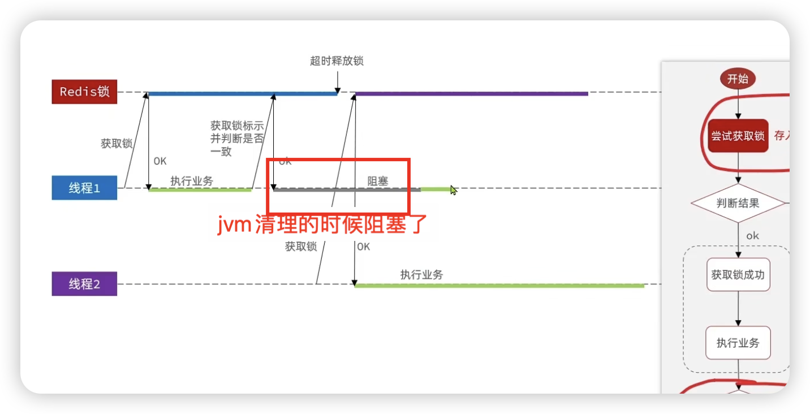

##### 1.首先是因为在分布式集群里，不同的tomcat不同的jvm也就有不同的锁监视器，那么就不能通过synchonized来实现锁了，这时候我们需要一个公共的锁监视器，


##### 2.使用redis来弄一个锁，获取锁使用setnx，释放锁使用del，然后以防宕机导致锁一直无法释放导致死锁的发生，所以我们要加上一个ttl。到期释放。<u>把这一系列方法封装到一个类里</u>

##### 3.可能会因为线程1获取锁之后阻塞，锁过期自动释放，线程2获取锁，此时线程1阻塞结束释放了线程2的锁，导致线程3可以进来，线程2和线程3都运行导致一用户一单出现问题。 

此时我们使用在setnx中存入一个字段，然后在释放锁之前判断一下是不是自己的锁，是的话就可以释放锁，不是的话就不释放，撤销之前的操作。

##### 4.线程1在判断是自己的锁然后进行释放锁的时候阻塞了【因为这里的判断和释放是两个动作】，阻塞时间过长导致锁自动释放了，这时候线程2获取了锁，然后这时候不堵了线程1释放了锁，又导致了线程2和3同时进行业务导致错误。


所以我们应该让他的判断锁标识和释放锁这两个操作同时，也就是让他们呈原子性。redis提供了lua脚本执行多条命令，`redis.call` 我们可以使用lua脚本来使判断和释放绑在一起

redis里面直接指令运行lua脚本 `eval "your_lua_script" 3 key1 key2 key3 arg1 arg2 这里的3是告诉redis前三个是key，其他是参数`

【注意⚠️，这里的下标是从1开始的】


jvm的Full GC




**java里RedisTemplate执行lua脚本**

redisTemplate.execute

```java
public <T> T execute(RedisScript<T> script, List<K> keys, Object... args)  //脚本 key的集合 传入的参数
```

一般脚本是独立的文件，有更好的灵活性，要把lua脚本转成RedisScript类型

如果使用io的读取，会大大降低效率而且可能会引发io异常

所以我们把这些放到static代码块里面，在类加载的时候自动就获取好

`。。`拼接

加载lua

```java
private final static DefaultRedisScript<Long> redisScript;
    static {
redisScript = new DefaultRedisScript<>();
redisScript.setLocation(new ClassPathResource("seckill.lua"));
redisScript.setResultType(Long.class);
    }
```

---


##### 5.使用redis里面的setnx来实现互斥还存在一些问题


我们使用redisson框架来实现分布式锁


不使用yaml文件配置，因为会覆盖spring对redis的配置


---

##### 6.现在的性能还是比较低，是因为我们redis判断和后续判断成功给数据库的写入操作是一条龙服务，在同一个线程里，mysql的操作拖累了redis，而且我们完全可以像面馆叫号一样，先给票，异步秒杀


这里的异步下单使用的是阻塞队列，线程向阻塞队列要值，要不到就会阻塞。

实现代码

```java
private BlockingDeque<VoucherOrder> blockingDeque = new LinkedBlockingDeque<>(1024*1024);
//这里因为不需要存入数据库太快，一个线程就可以了
private static final ExecutorService threadpool= Executors.newSingleThreadExecutor();
//@postConstruct是在这个类加载之后运行
@PostConstruct
public void init() {
    threadpool.submit(new MySeckillRunnable());
}
private class MySeckillRunnable implements Runnable {
    @Override
    public void run() {
        //阻塞队列是获取不到元素就阻塞，所以一直true不会导致性能损耗严重
        while(true){
            try {
                VoucherOrder order = blockingDeque.take();
                //因为前面的redis判断已经很安全了，这里就不用redisson了
                //然后同理就不需要事务了,因为不需要事务，所以就不用代理了
                save(order);
            } catch (InterruptedException e) {
                log.info("获取阻塞队列异常");
            }
        }
    }
}
```

##### 7.由于阻塞队列使用的是jvm虚拟机的内存，当高并发的时候性能还是不够，所以使用消息队列

这里先不说，到时候微服务rabbitmq来