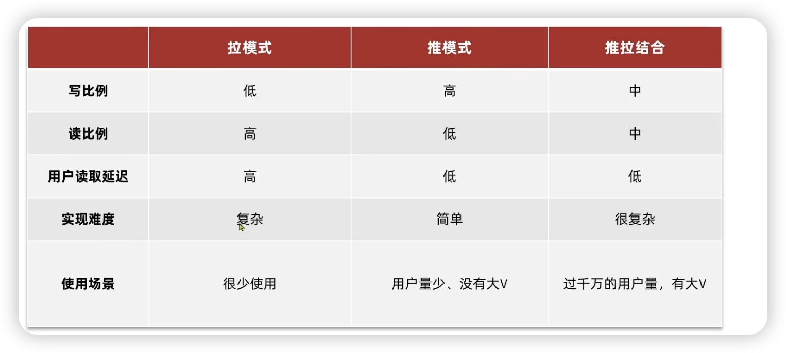

##### 1.点赞

###### 1.点赞的排行

比如微信上的显示最新点赞的几个人，可以通过ZSet来实现，score就存的是时间戳 `System.currenTimeMills()`现在的时间的毫秒表示

##### 2.关注

###### 2.1共同关注

在存入mysql数据库的同时在redis里面存入 follows:userId    value为关注的人的id

这样的目的是可以使用set的Sinter来取到交集从而得到**共同关注**

###### 2.2推送到粉丝收件箱

这里的拉模式就是每一个粉丝从关注的人那里拉过来，推就是直接发到每一个粉丝的信箱。因为推模式更高效，所以对于那些用户量很多的而且有那种大V的，就使用推拉结合的模式，也就是对铁粉使用推模式，对僵尸粉使用拉模式。

我们这里使用推模式。

###### 2.3滚动分页查询

就是滑到底再滑就刷新更多的数据