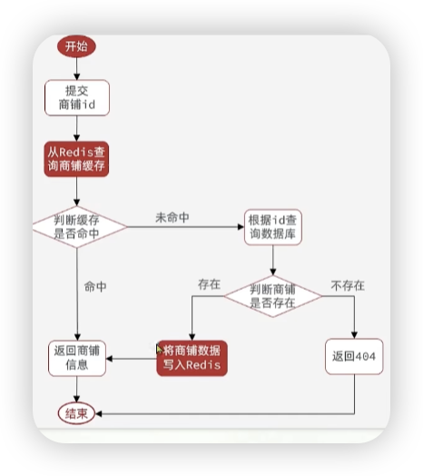
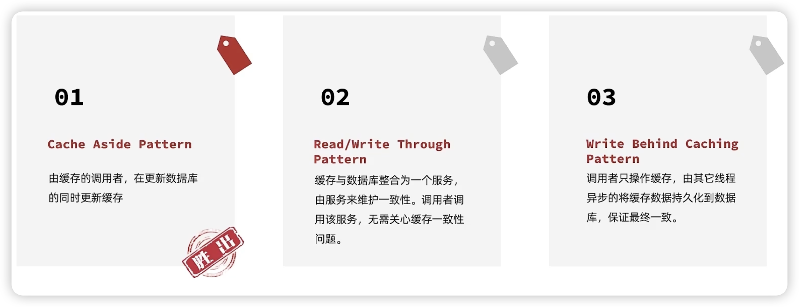
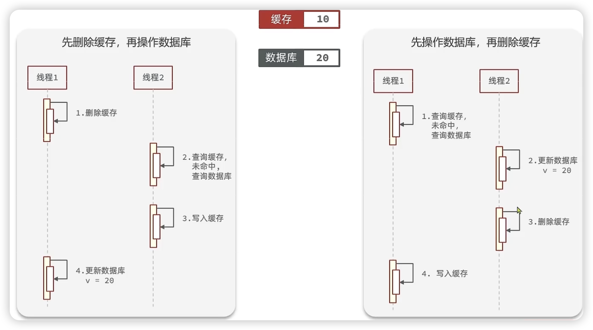
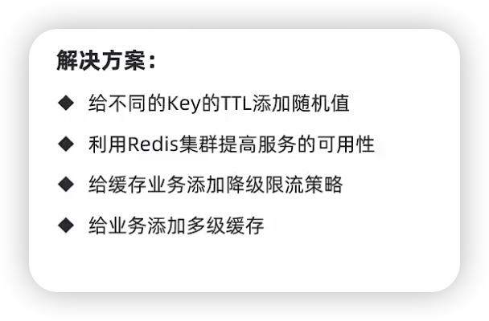
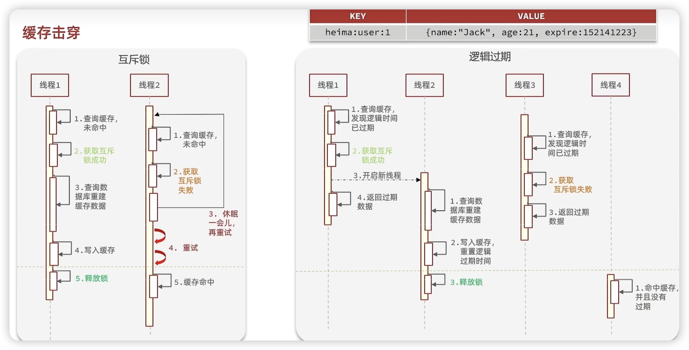
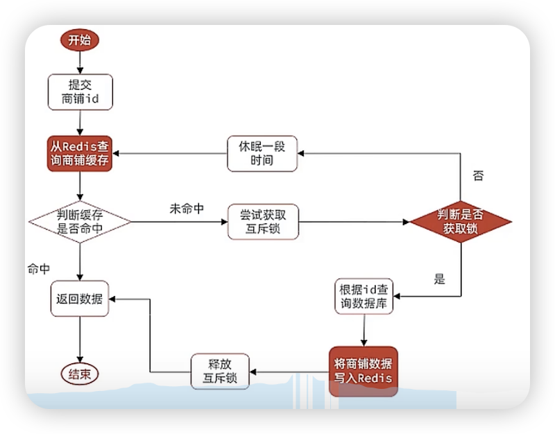
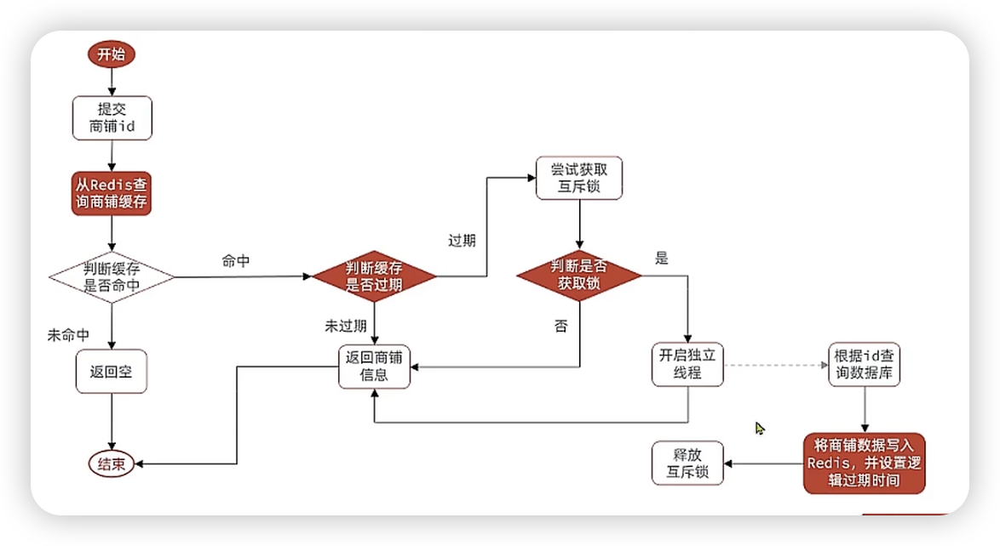
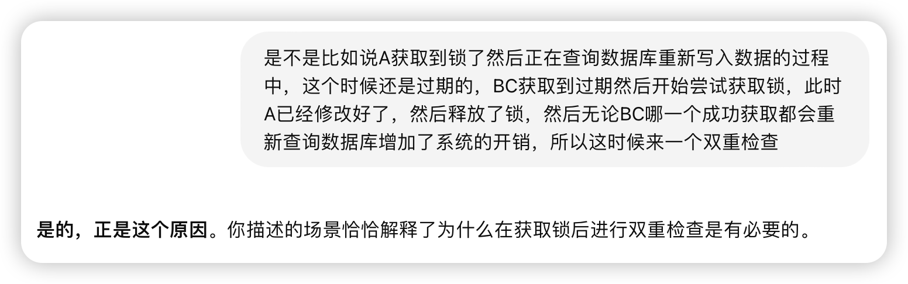

#### 缓存更新策略

1.内存淘汰：不维护，内存不足时自动淘汰部分数据

2.超时剔除：设置一个expire

3.主动更新：在更新数据库的同时更新redis数据库


对于那些高一致性的需求：比如显示详情这样的，店家更改了详情都得更新，不放心的话可以再加一个超时剔除兜底

---



#### 主动更新



1方法更可控，企业用这个方法的比较多。

有两种：1.更新缓存：即每一次更新数据库的时候更新缓存

​				2.删除缓存：每次更新数据库的时候直接把缓存删除，直到下一次查询的时候才会写入缓存。

一般更推荐用第二种，因为第一种如果一直修改不读，导致缓存的有效写入很少

---


所以先删缓存还是先操作数据库呢？



右边最上面是刚好redis过期了，未命中缓存，所以右边的发生可能性更低

#### 缓存穿透

概念：就是传一个不存在的参数，然后依次访问缓存和数据库，有点像ddos攻击。

有两个方法

1. 缓存一个空对象，即未命中数据库也向缓存里面存一个空对象。

   ```
   优点：简单，维护方便
   缺点：因为存储到redis，对内存有额外的消耗，而且假如这个时候真的在数据库里插入了一个这个参数的对象，会导致缓存和数据库数据的短期不一致
   ```

   

2. 布隆过滤：有点像之前和你讲的那个位运算的01，也就是bool数组来判断，用复杂的算法，在传来参数的第一时间经过这个过滤器，如果存在就继续访问缓存，若不存在直接让他滚。

```
优点：不占用内存
缺点：还是有几率过滤出错，实现比较难
```

---

##### 缓存穿透代码

```java
 public Shop queryByIdWithPassThrough(Long id) {
        //TODO 在命中缓存的时候如果是空直接返回一个空
        Map<Object, Object> entries = redisTemplate.opsForHash().entries(RedisConstants.CACHE_SHOP_KEY + id.toString());
        if (entries.containsKey("placeholder")) {
            return null;
        }
        if (!entries.isEmpty()) {
            Shop shop = BeanUtil.fillBeanWithMap(entries, new Shop(), false);
            return shop;
        }


        Shop shop = query().eq("id", id).one();
//TODO 如若数据库命中不了，则写入一个空缓存到redis,这里因为使用的是hash，不好写空，写空就不会插入了
        if (shop == null) {
            Map<String, Object> map = new HashMap<>();
            map.put("placeholder", null);
            redisTemplate.opsForHash().putAll(RedisConstants.CACHE_SHOP_KEY + id, map);
            redisTemplate.expire(RedisConstants.CACHE_SHOP_KEY + id.toString(), 5, TimeUnit.MINUTES);
            return null;
        }
        Map<String, Object> map = BeanUtil.beanToMap(shop, new HashMap<>(), CopyOptions.create().
                setFieldValueEditor((k, v) -> (v != null ? v.toString() : "")));
        redisTemplate.opsForHash().putAll(RedisConstants.CACHE_SHOP_KEY + id.toString(), map);
        redisTemplate.expire(RedisConstants.CACHE_SHOP_KEY + id.toString(), 30, TimeUnit.MINUTES);
        return shop;
    }
```


#### 缓存雪崩



概念：同一时间内大量缓存同时失效了，或者redis服务器直接炸了，大量请求到达数据库

上面的解决方案解读：

1.没啥好说

2.redis高级里面说了，集群和主从，主服务器坏了用从服务器，而且主从有数据一致性，不用担心数据

3.在springcloud课程里有，比如快速失败拒绝服务

4.不仅在redis上缓存，还可以在浏览器，nginx等上添加缓存，那个未命中再请求redis再xxx这样。

#### 缓存击穿

概念：热点key，被高并发访问，然后重建比较复杂

因为很多不是直接查到的东西直接写入redis，所以 查询数据库，重建缓存数据的过程比较久，然后这时候无数个请求都未命中，然后无数个请求查询数据库重建缓存，数据库就会坏

---

2个方法：互斥锁和逻辑过期（不设置ttl，设置一个expire字段）



优缺点：

互斥锁：1. 优点：数据一致性、实现简单、对内存的消耗少

​				2.缺点：因为后续的请求获取互斥锁失败后要一直等，所以性能不好、死锁

这里的锁不是用哪个synchronize，是自己定义

逻辑过期：1.优点：性能好

​					2.缺点：因为加了字段对内存消耗更多，数据一致性差，复杂

一个问题：为什么还需要新线程？

1. **非阻塞处理**：在获取锁的线程中直接查询数据库和更新缓存，可能会导致该线程阻塞较长时间。这会影响当前请求的响应速度，尤其是数据库查询时间较长的情况下。而新线程可以**<u>异步执行查询和更新操作，避免阻塞</u>。** 
2. **提高响应速度**：通过返回旧数据，主线程可以立即响应用户请求，不必等待数据库查询完成。这种设计可以在一定程度上<u>**提高系统的响应速度和用户**体验</u>，尤其是在缓存击穿发生时，这点尤为重要。
3. **锁持有时间最小化**：如果不使用新线程而在锁持有期间执行数据库查询和更新，<u>**锁的持有时间会变长，可能会阻塞其他请求**。</u>通过将数据库查询交给新线程，主线程可以尽快释放锁，从而减少锁的竞争，提高系统的并发性能。

---

##### 互斥锁代码

流程图



```java
    private Shop queryByIdWithHotKeyBrokenMutex(Long id) {
        //TODO 在命中缓存的时候如果是空直接返回一个空
        Map<Object, Object> entries = redisTemplate.opsForHash().entries(RedisConstants.CACHE_SHOP_KEY + id.toString());
        if (entries.containsKey("placeholder")) { //这里是缓存穿透的
            return null;
        }
        if (!entries.isEmpty()) {   //未穿透
            Shop shop = BeanUtil.fillBeanWithMap(entries, new Shop(), false);
            return shop;
        }

        //----这里开始真正的未命中
        if (lock("lock")) {
            //成功获取锁 查询数据库，查到则把结果写入redis，若没查到则写入一个空的到缓存里，若查到了讲数据写入redis里面，然后释放锁
            Shop shop = query().eq("id", id).one();

            //数据库里面没有
            if (shop == null) {
                Map<String, Object> map = new HashMap<>();
                map.put("placeholder", null);
                redisTemplate.opsForHash().putAll(RedisConstants.CACHE_SHOP_KEY + id, map);
                redisTemplate.expire(RedisConstants.CACHE_SHOP_KEY + id.toString(), 5, TimeUnit.MINUTES);
                return null;
            }
            //数据库里有
            Map<String, Object> map = BeanUtil.beanToMap(shop, new HashMap<>(), CopyOptions.create().
                    setFieldValueEditor((k, v) -> (v != null ? v.toString() : "")));
            redisTemplate.opsForHash().putAll(RedisConstants.CACHE_SHOP_KEY + id.toString(), map);
            redisTemplate.expire(RedisConstants.CACHE_SHOP_KEY + id.toString(), 30, TimeUnit.MINUTES);
            unlock("lock");
            return shop;

        } else {
            try {
                Thread.sleep(10);
            } catch (InterruptedException e) {
                e.printStackTrace();
            }
            return queryByIdWithHotKeyBrokenMutex(id);

        }


    }

    private boolean lock(String key) {
        Boolean flag = redisTemplate.opsForValue().setIfAbsent(key, "lock", 10, TimeUnit.SECONDS);
        //直接返回会自动拆箱，可能得到null，所以使用hutool里面的方法来拆
        return BooleanUtil.isTrue(flag);
    }

    private void unlock(String key) {
        redisTemplate.delete(key);
    }
```

以上代码可优化的点:这里用到了递归，大大增加了堆栈的空间，可以用while代替

---

##### 逻辑过期代码



```java
public Shop queryByIdWithLogiExpir(Long id) {
        //我们这里使用String类型的redis
        String s = redisTemplate.opsForValue().get(RedisConstants.CACHE_SHOP_KEY + id);
        RedisData redisData = JSONUtil.toBean(s,RedisData.class);
        // 1.缓存未命中返回空
        //这里注意，如果没有，redisData里面各个变量是null但是不会 redisData==null
        if (!StrUtil.isNotBlank(s)) {
            return null;
        }
        // 2.若命中判断你的缓存是否过期
        // 3.若未过期，直接返回商铺信息
        // 4.若过期，获取锁，若获取失败直接返回老的（直到新的缓存写入）
        // 5.获取成功，开一个额外的线程，查询数据库，把数据写入缓存(设置时间)，释放锁
        if (!LocalDateTime.now().isAfter(redisData.getExpireTime())) {
            return (Shop) redisData.getData();
        }
        if (lock("lock")) {
//TODO 就算获得了还要再次获取缓存检测是否过期，双重检查 ，原因我会写在文档并举例子
            String s1 = redisTemplate.opsForValue().get(RedisConstants.CACHE_SHOP_KEY + id.toString());
            RedisData redisData1 = JSONUtil.toBean(s1,RedisData.class);
            if (LocalDateTime.now().isBefore(redisData1.getExpireTime())) {
                return (Shop) redisData1.getData();
            }
            Thread thread = new Thread(new Runnable() {

                @Override
                public void run() {

                    query_updateRedis(id);
                    unlock("lock");
                }

                private void query_updateRedis(Long id) {
                    Shop shop = query().eq("id", id).one();
                    RedisData redisData = new RedisData();
                    redisData.setData(shop);
                    redisData.setExpireTime(LocalDateTime.now().plusSeconds(300));
                    String json = JSONUtil.toJsonStr(redisData);
                    redisTemplate.opsForValue().set(RedisConstants.CACHE_SHOP_KEY + id.toString(), json);
                }
            });
            thread.start();


            return (Shop) redisData.getData();
        } else return (Shop) redisData.getData();


        //TODO 有一个setnx
    }
```

问题：为什么这里判断了拿到了锁还要再次从redis获取过期时间进行二次检查呢

完美的例子


二次检查的好处：（数据一致性没有）

**避免重复查询数据库**：

- 当多个线程几乎同时发现缓存过期时，可能会有多个线程试图获取锁。假设线程 A 率先获取到锁，其他线程（B、C）会被阻塞。线程 A 在获取锁后，会去查询数据库并更新缓存。
- 如果线程 A 更新了缓存后，线程 B 获得了锁并再次查询数据库，这就导致了不必要的数据库查询，增加了系统的开销。

**提升性能**：

- 通过在锁内再做一次缓存检查，可以避免重复的数据库查询操作。只要线程 A 已经成功更新了缓存，线程 B 就不需要再查询数据库，而是直接使用缓存中的新数据。这样能显著提高系统的性能和吞吐量。