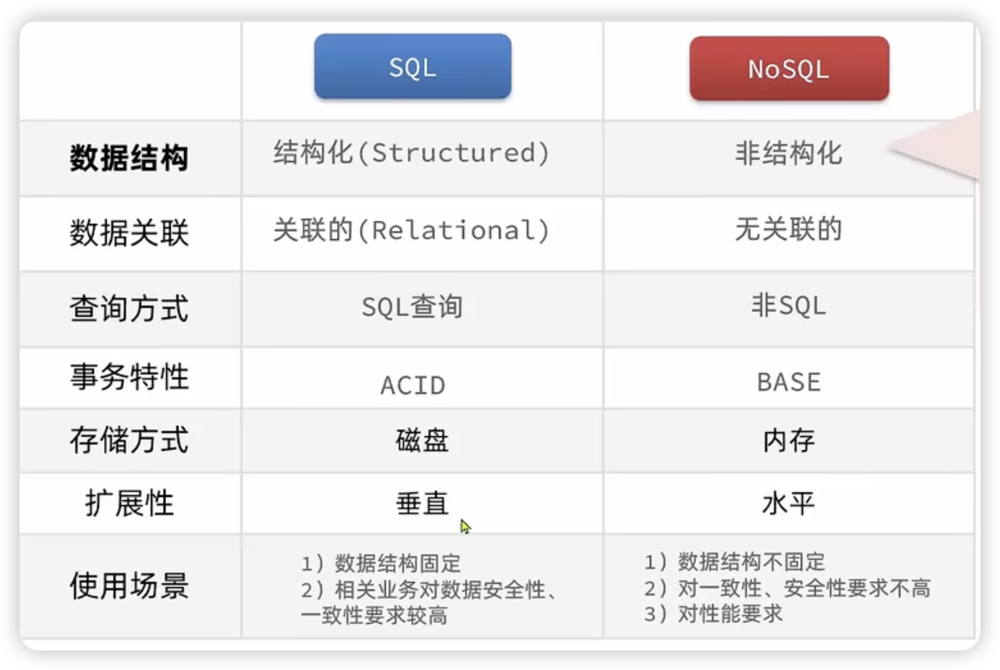

存储在内存上：性能更强，查询效率更高

拓展性这个：mysql数据都是存在本机，可以通过提高本机的性能提高数据库的性能，不能提升数据存储的量；Nosql数据库一开始就考虑了数据拆分的需求，在插入数据的时候会跟据唯一标识去做一个哈希运算，根据这个运算的结果来决定数据要存储在哪一个节点上，就能很方便的对数据库进行拆分

1.在redis6.0已经可以多线程，但是只是针对网络编程，所以还是单线程，而且并不会因为是单线程而效率低

2.基于内存是影响速度最快，是c语言写的

3.比如突然断电不会数据丢失

4.分片集群：比如1tb的数据分成n分，放到n个节点（电脑），就可以灵活地水平扩展