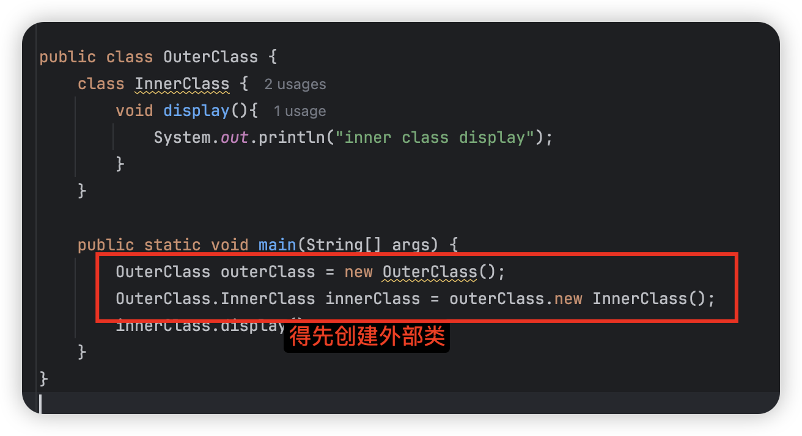
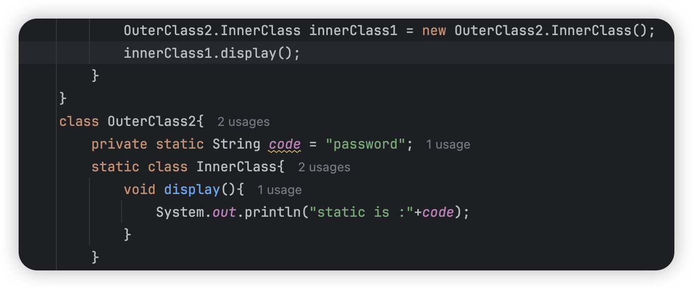
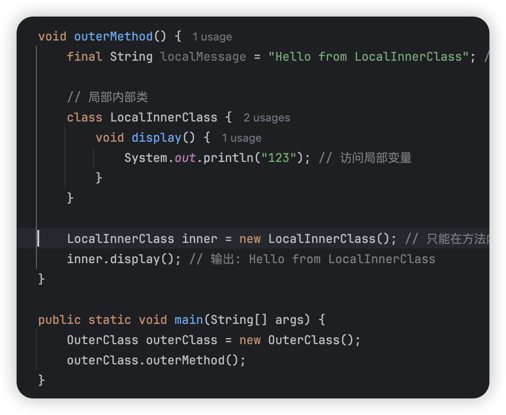
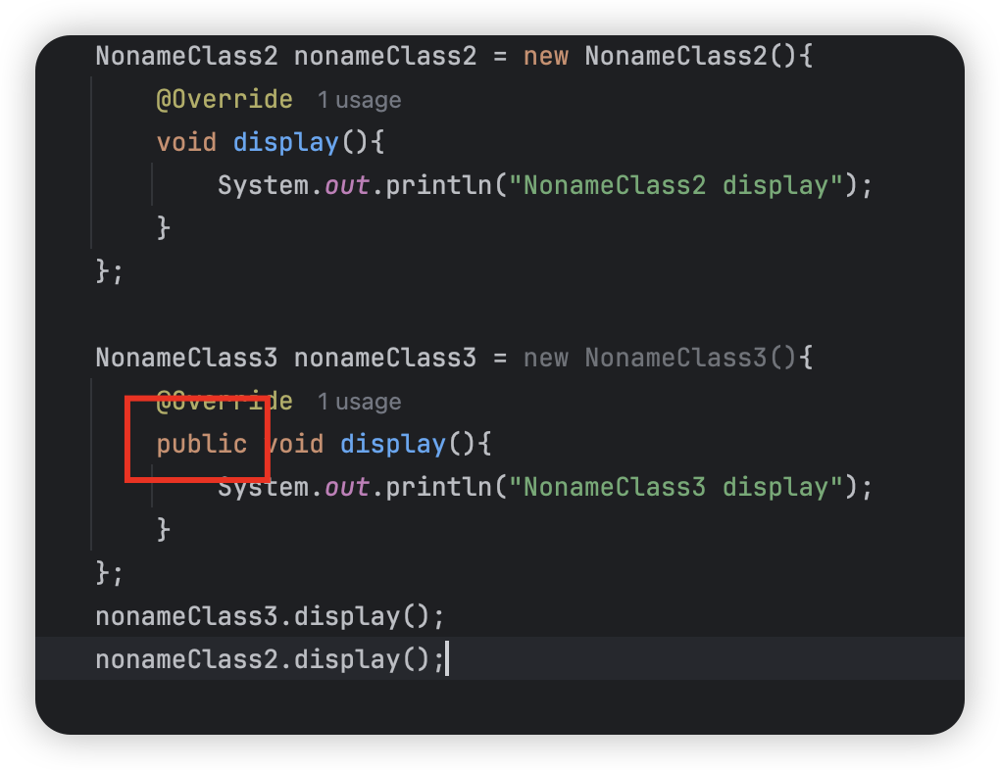

#### 一、**abstract**关键字

1.abstract放在方法和类之前，表示该类没有完全实现，不能实例化。

2.抽象类的特点：

---

​	1.不能被实例化，但是可以有构造方法让子类实现

​	2.可以有非抽象方法

---

3.不能，final虽然可以被继承，但是不能被重写，但是抽象方法无法被重写的话就不能正常使用

4.错了，因为抽象类无法实例化

5.。。easy

6.。。easy

#### 二、内部类

1.**成员内部类、静态内部类、局部内部类**和**匿名内部类**

---

成员内部类：

```
1.成员内部类可以访问外部类的所有成员，包括私有的
2.创造内部类之前，必须先创造外部类
```



静态内部类：

```
1.仅可以访问外部类的静态资源
2.不依赖外部类的实例，可以直接创建实例
```



局部内部类 local inner class

```
1.局部内部类只能在方法、代码块、构造器内
2.局部内部类必须在方法内实例化
3.可以使用所在方法里面的变量，但是必须要final【这里的final放在方法里，因为要确保局部内部类和所在的方法或者别的东西的生命周期一致】
```



匿名内部类：

没有名字的类，可以直接继承类/抽象类，或者实现接口，直接重写方法。

ps：接口内的所有方法都是默认**public**，所以重写必须public



2.

```java
 static Inner method() {
        return new Inner() {
             @Override
             public void show() {
                 System.out.println("void show is used");
             }
         };

     }
```

3.

```java
  Action action1 = new Action() {
            @Override
            public String[] test(String str) {
                return str.split("\\|");
            }
        };

        Action action2 = new Action() {
            @Override
            public String[] test(String str) {
                return str.split("-");
            }
        };
```

#### 三、访问控制

defalut仅限于一个包内的其他类访问

protected只能子类，可以其他包

public 所有类都可以访问

可能这里不理解这里的所有类可以访问，就是直接对象.成员变量名访问

```
animal.name()  在非子类里，如果name是protect就无法访问
public就可以
```

#### 四、interface

1.要实现抽象类的所有方法时继承抽象类，有共同的基础行为用抽象类；接口是要实现一个或多个指定的方法

2.easy

3.easy

#### 五、包装类

1.int Integer

char Character

double Double

boolean Boolean

float Float

byte Byte

short Short

long Long

2.

```
输出结果：
【-128~127】 
false
true

false
true

true
true

false
true

true
true
```

#### 六、Object类

1.==对于基本数据类型直接比较值，对于引用类型，则是比较地址

equals是比较同类型的对象的值是否相同

==可以自动装箱和拆箱

2.easy

#### 七、**String**字符串比较问题

1.

```java
String str1 = "hello"; 
String str2 = "hello";
String str3 = new String("hello");
String str4 = new String("hello");
String str5 = "hellohello";
String str6 = str1 + str2;
System.out.println(str1 == str2); //true
System.out.println(str2 == str3); //false
System.out.println(str3 == str4); //false
System.out.println(str2.equals(str3));//true
System.out.println(str3.equals(str4));//true
System.out.println(str5.equals(str6));//true
System.out.println(str5 == str6);//false
```

2.

string转其他：

基本数据类型时parseInt

包装类是valueof

其他转string：

基本数据类型：包装类.toString

包装类: 对象.toString